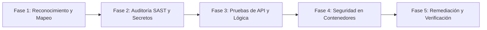
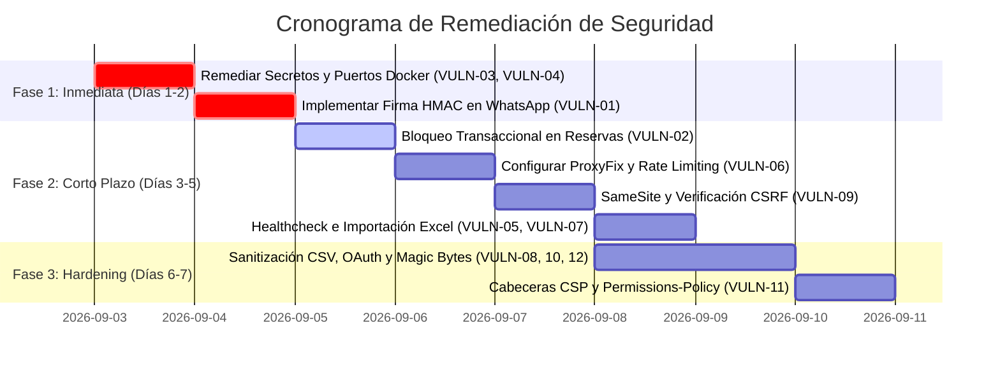

# Plan de Evaluación e Informe de Ciberseguridad: Humberto Dealer

**Fecha de evaluación:** Septiembre 2026  
**Objetivo de evaluación:** Plataforma Web Concesionaria Humberto Dealer (Frontend Next.js 16 + Backend Flask 3 + MySQL 8 + WhatsApp Cloud API)  
**Marco Metodológico de Referencia:** [Anthropic Cybersecurity Skills Repository](file:///C:/Users/jeanm/Desktop/Anthropic-Cybersecurity-Skills) (NIST CSF 2.0, MITRE ATT&CK, OWASP Top 10 API 2023 & OWASP Top 10 Web 2021)  
**Estado:** Auditoría Técnica y Diagnóstico de Vulnerabilidades con Plan de Remediación  

---

## 1. Resumen Ejecutivo

Este documento consolida el **Plan Integral de Evaluación de Ciberseguridad** y el **Informe Técnico de Vulnerabilidades y Remediaciones** para el sistema **Humberto Dealer**. La auditoría analizó la arquitectura desacoplada del sistema, los flujos de autenticación local y Google OAuth 2.0, el manejo de reservas, la importación/exportación de archivos masivos, las integraciones con webhooks de Meta WhatsApp Cloud API y el despliegue contenerizado en Docker.

Para la ejecución de esta evaluación se han incorporado formalmente los procedimientos y estándares establecidos en el repositorio `Anthropic-Cybersecurity-Skills`:
* `conducting-api-security-testing`
* `testing-api-security-with-owasp-top-10`
* `testing-api-authentication-weaknesses`
* `testing-api-for-broken-object-level-authorization`
* `performing-web-application-penetration-test`
* `performing-security-headers-audit`
* `hardening-docker-containers-for-production`
* `implementing-secret-scanning-with-gitleaks`
* `implementing-api-rate-limiting-and-throttling`
* `exploiting-race-condition-vulnerabilities`

### Resumen de Hallazgos

| Severidad | Cantidad | Estado |
| :--- | :---: | :--- |
| **Alta** | 4 | Remediación requerida antes de producción |
| **Media** | 6 | Remediación a corto plazo |
| **Baja / Informativa** | 2 | Mejora recomendada (Hardening) |

---

## 2. Metodología y Plan de Evaluación

El plan de evaluación de seguridad sigue una estructura cíclica de 5 fases alineada con NIST CSF (*Identify, Protect, Detect, Respond*) y MITRE ATT&CK for Enterprise:



### Fase 1: Reconocimiento y Mapeo de Superficie de Ataque
* **Skill base:** `conducting-api-security-testing`
* **Objetivos:** Identificar todos los puntos de entrada HTTP, esquemas de endpoints, métodos no autenticados vs protegidos, y redirecciones de proxy Next.js.
* **Componentes evaluados:**
  - Blueprints Flask: `/api/auth`, `/api/catalogo`, `/api/admin`, `/api/reservas`, `/api/borradores`, `/api/location`, `/api/whatsapp`, `/api/health`.
  - Rewrite Proxy: `next.config.mjs` reescribiendo `/api/*` hacia el backend Flask.

### Fase 2: Análisis Estático de Código Fuente (SAST) y Gestión de Secretos
* **Skills base:** `implementing-secret-scanning-with-gitleaks`, `implementing-secrets-management-with-vault`
* **Objetivos:** Detectar credenciales embebidas, valores por defecto en archivos de orquestación, validación insuficiente de tipos de entrada y patrones de ejecución inseguros.

### Fase 3: Pruebas de API, Autenticación y Lógica de Negocio
* **Skills base:** `testing-api-security-with-owasp-top-10`, `testing-api-authentication-weaknesses`, `testing-api-for-broken-object-level-authorization`, `exploiting-race-condition-vulnerabilities`
* **Objetivos:**
  - Pruebas BOLA / IDOR en recursos de reservas y vehículos.
  - Análisis del ciclo de vida de cookies de sesión (`Flask-Login`) y tokens OAuth.
  - Detección de condiciones de carrera en reservas y concurrencia.
  - Verificación de autenticidad en webhooks externos.

### Fase 4: Auditoría de Infraestructura y Contenedores
* **Skills base:** `hardening-docker-containers-for-production`, `performing-security-headers-audit`
* **Objetivos:**
  - Inspección de `docker-compose.yml` y `Dockerfile`.
  - Exposición de puertos en interfaces de red públicas.
  - Privilegios de usuarios en contenedores y políticas de red interna.
  - Configuración de cabeceras HTTP de seguridad (CSP, HSTS, X-Content-Type-Options, Referrer-Policy).

### Fase 5: Triaje de Vulnerabilidades y Plan de Remediación
* **Objetivos:** Clasificación técnica bajo CVSS v3.1, entrega de parches de código definitivos y plan de verificación continua.

---

## 3. Matriz de Vulnerabilidades Identificadas

| ID | Vulnerabilidad | Severidad | CVSS v3.1 | CWE / OWASP | Ubicación Principal |
| :--- | :--- | :---: | :---: | :--- | :--- |
| **VULN-01** | Ausencia de Validación de Firma Criptográfica en Webhook de WhatsApp | **Alta** | 8.2 | CWE-345 / OWASP API2:2023 | [whatsapp.py](file:///c:/Users/jeanm/Desktop/humberto-dealer/backend/backend/blueprints/whatsapp.py#L28) |
| **VULN-02** | Condición de Carrera (TOCTOU) en Concurrencia de Reservas | **Alta** | 7.4 | CWE-367 / OWASP API6:2023 | [reservas.py](file:///c:/Users/jeanm/Desktop/humberto-dealer/backend/backend/blueprints/reservas.py#L28) |
| **VULN-03** | Secretos y Credenciales Débiles por Defecto en Despliegue Docker | **Alta** | 7.5 | CWE-1188, CWE-798 / OWASP API8:2023 | [docker-compose.yml](file:///c:/Users/jeanm/Desktop/humberto-dealer/docker-compose.yml#L14) |
| **VULN-04** | Exposición de Puertos Internos (MySQL y Flask) en Interfaz Pública | **Alta** | 7.0 | CWE-668 / OWASP API8:2023 | [docker-compose.yml](file:///c:/Users/jeanm/Desktop/humberto-dealer/docker-compose.yml#L17) |
| **VULN-05** | Fuga de Información de Base de Datos e Infraestructura en `/api/health` | **Media** | 5.3 | CWE-209 / OWASP API8:2023 | [__init__.py](file:///c:/Users/jeanm/Desktop/humberto-dealer/backend/backend/__init__.py#L86) |
| **VULN-06** | Ausencia de `ProxyFix` en Flask genera DoS y Evasión en `Limiter` | **Media** | 6.5 | CWE-400 / OWASP API4:2023 | [__init__.py](file:///c:/Users/jeanm/Desktop/humberto-dealer/backend/backend/__init__.py#L19) |
| **VULN-07** | Sobrescritura de Archivo Temporal y Conflicto en Importación Excel | **Media** | 5.5 | CWE-377, CWE-362 / OWASP API6:2023 | [borradores.py](file:///c:/Users/jeanm/Desktop/humberto-dealer/backend/backend/blueprints/borradores.py#L34) |
| **VULN-08** | Inyección de Fórmulas en Hoja de Cálculo (CSV/Spreadsheet Formula Injection) | **Media** | 6.1 | CWE-1236 / OWASP Web A03:2021 | [excel.py](file:///c:/Users/jeanm/Desktop/humberto-dealer/backend/backend/services/excel.py#L295) |
| **VULN-09** | Configuración de Sesión `SameSite=None` sin Tokens Anti-CSRF | **Media** | 6.5 | CWE-352 / OWASP Web A01:2021 | [config.py](file:///c:/Users/jeanm/Desktop/humberto-dealer/backend/backend/config.py#L72) |
| **VULN-10** | Riesgo de Account Takeover en Vinculación Automática de Google OAuth | **Media** | 6.8 | CWE-287 / OWASP API2:2023 | [auth.py](file:///c:/Users/jeanm/Desktop/humberto-dealer/backend/backend/blueprints/auth.py#L133) |
| **VULN-11** | Omisión de Cabeceras Modernas de Protección (CSP y Permissions-Policy) | **Baja** | 4.3 | CWE-693 / OWASP Web A05:2021 | [__init__.py](file:///c:/Users/jeanm/Desktop/humberto-dealer/backend/backend/__init__.py#L96) |
| **VULN-12** | Validación de Imágenes Únicamente por Extensión de Cadena de Texto | **Baja** | 4.0 | CWE-434 / OWASP API8:2023 | [admin.py](file:///c:/Users/jeanm/Desktop/humberto-dealer/backend/backend/blueprints/admin.py#L348) |

---

## 4. Detalle Técnico de Vulnerabilidades y Soluciones Propuestas

---

### VULN-01: Ausencia de Validación de Firma Criptográfica en Webhook de WhatsApp

* **Severidad:** **Alta** (CVSS:3.1/AV:N/AC:L/PR:N/UI:N/S:U/C:N/I:H/A:L — Base Score: 8.2)
* **Categoría:** CWE-345 (Insufficient Verification of Data Authenticity), OWASP API2:2023 (Broken Authentication)
* **Skill de referencia:** `conducting-api-security-testing`, `testing-api-security-with-owasp-top-10`
* **Ubicación:** [backend/backend/blueprints/whatsapp.py:L28-L45](file:///c:/Users/jeanm/Desktop/humberto-dealer/backend/backend/blueprints/whatsapp.py#L28-L45)

#### Descripción del Problema
El endpoint `POST /api/whatsapp/webhook` procesa mensajes entrantes enviados por Meta (WhatsApp Business API). Sin embargo, el código solo valida el token de suscripción en el método `GET`, ignorando por completo la cabecera `X-Hub-Signature-256` en las peticiones `POST`.
Cualquier actor malicioso en Internet puede enviar peticiones HTTP simulando mensajes de clientes legítimos, saturar al dueño del concesionario con cotizaciones falsas, interactuar con el bot de citas y generar sobrecarga de procesamiento en la base de datos.

#### Código Vulnerable
```python
# backend/backend/blueprints/whatsapp.py
@bp.post("/webhook")
def recibir_mensaje():
    try:
        payload = request.get_json(silent=True) or {}
        entry   = payload.get("entry", [])
        # Se procesa el mensaje directamente sin validar si provino de Meta
        for e in entry:
            ...
```

#### Solución Propuesta
Verificar la cabecera `X-Hub-Signature-256` utilizando el `WHATSAPP_APP_SECRET` con `hmac.compare_digest` antes de procesar el cuerpo de la solicitud:

```python
import hmac
import hashlib
from flask import abort

def validar_firma_whatsapp(app_secret: str, raw_body: bytes, signature_header: str | None) -> bool:
    if not signature_header or not signature_header.startswith("sha256="):
        return False
    signature = signature_header.split("sha256=", 1)[1]
    expected = hmac.new(
        key=app_secret.encode("utf-8"),
        msg=raw_body,
        digestmod=hashlib.sha256
    ).hexdigest()
    return hmac.compare_digest(expected, signature)

@bp.post("/webhook")
def recibir_mensaje():
    app_secret = current_app.config.get("WHATSAPP_APP_SECRET")
    if app_secret:
        sig = request.headers.get("X-Hub-Signature-256")
        if not validar_firma_whatsapp(app_secret, request.get_data(), sig):
            log.warning("Firma de WhatsApp no válida o ausente")
            return jsonify({"error": "Firma no autorizada"}), 401
            
    payload = request.get_json(silent=True) or {}
    ...
```

---

### VULN-02: Condición de Carrera (TOCTOU) en Concurrencia de Reservas

* **Severidad:** **Alta** (CVSS:3.1/AV:N/AC:L/PR:L/UI:N/S:U/C:N/I:H/A:N — Base Score: 7.4)
* **Categoría:** CWE-367 (Time-of-check Time-of-use Race Condition), OWASP API6:2023 (Business Logic Flaw)
* **Skill de referencia:** `exploiting-race-condition-vulnerabilities`, `testing-api-security-with-owasp-top-10`
* **Ubicación:** [backend/backend/blueprints/reservas.py:L28-L58](file:///c:/Users/jeanm/Desktop/humberto-dealer/backend/backend/blueprints/reservas.py#L28-L58)

#### Descripción del Problema
Cuando un usuario reserva un vehículo a través de `POST /api/reservas`, el sistema realiza:
1. `vehiculo = db.get_or_404(Vehiculo, int(vid))`
2. `if vehiculo.estado != "DISPONIBLE": return error`
3. `vehiculo.estado = "RESERVADO"`
4. `db.session.commit()`

No existe un bloqueo de fila a nivel de base de datos (`SELECT ... FOR UPDATE`). Si dos clientes pulsan el botón de reserva al mismo milisegundo (o un script automatizado envía dos peticiones paralelas), ambas sesiones leerán el vehículo con estado `DISPONIBLE`. Ambas transacciones insertarán una reserva y marcarán el vehículo, generando dos reservas simultáneas para el mismo activo de alta gama.

#### Código Vulnerable
```python
# backend/backend/blueprints/reservas.py
vehiculo = db.get_or_404(Vehiculo, int(vid))
if vehiculo.estado != "DISPONIBLE":
    return jsonify({"error": "Vehículo no disponible para reserva"}), 422

# Ventana de carrera: otro proceso puede leer vehiculo.estado como DISPONIBLE aquí
vehiculo.estado = "RESERVADO"
db.session.add(reserva)
db.session.commit()
```

#### Solución Propuesta
Utilizar bloqueo pesimista en SQLAlchemy mediante `with_for_update()` o una actualización atómica condicional:

```python
# backend/backend/blueprints/reservas.py
@bp.post("/")
@login_required_api
def crear_reserva():
    try:
        data = request.get_json(silent=True) or {}
        vid  = data.get("vehiculo_id")
        if not vid:
            return jsonify({"error": "vehiculo_id es obligatorio"}), 400

        # Bloqueo pesimista de fila en la transacción actual
        vehiculo = (
            Vehiculo.query
            .filter_by(id=int(vid))
            .with_for_update()
            .first()
        )
        if not vehiculo:
            return jsonify({"error": "Vehículo no encontrado"}), 404

        if vehiculo.estado != "DISPONIBLE":
            return jsonify({"error": "Vehículo no disponible para reserva"}), 422

        cliente = Cliente.query.filter_by(usuario_id=current_user.id).first()
        if not cliente:
            partes = current_user.nombre.strip().split(' ', 1)
            cliente = Cliente(
                usuario_id=current_user.id,
                nombre=partes[0],
                apellido=partes[1] if len(partes) > 1 else '-',
                email=current_user.email,
            )
            db.session.add(cliente)
            db.session.flush()

        existente = Reserva.query.filter_by(
            vehiculo_id=vehiculo.id, cliente_id=cliente.id, estado="EN_PROCESO"
        ).first()
        if existente:
            return jsonify({"error": "Ya tienes una reserva activa para este vehículo"}), 409

        reserva = Reserva(
            vehiculo_id=vehiculo.id,
            cliente_id=cliente.id,
            notas=data.get("notas"),
        )
        vehiculo.estado = "RESERVADO"
        db.session.add(reserva)
        db.session.commit()
        return jsonify({"mensaje": "Reserva creada", "reserva": reserva.to_dict()}), 201
    except Exception as exc:
        db.session.rollback()
        log.error("crear_reserva: %s", exc)
        return jsonify({"error": "Error interno"}), 500
```

---

### VULN-03: Secretos y Credenciales Débiles por Defecto en Despliegue Docker

* **Severidad:** **Alta** (CVSS:3.1/AV:N/AC:L/PR:N/UI:N/S:U/C:H/I:N/A:N — Base Score: 7.5)
* **Categoría:** CWE-1188 (Insecure Default Initialization), CWE-798 (Use of Hard-coded Credentials), OWASP API8:2023 (Security Misconfiguration)
* **Skill de referencia:** `implementing-secret-scanning-with-gitleaks`, `hardening-docker-containers-for-production`
* **Ubicación:** [docker-compose.yml:L14-L15](file:///c:/Users/jeanm/Desktop/humberto-dealer/docker-compose.yml#L14-L15), [docker-compose.yml:L41-L43](file:///c:/Users/jeanm/Desktop/humberto-dealer/docker-compose.yml#L41-L43)

#### Descripción del Problema
En `docker-compose.yml`, las variables de entorno cuentan con valores de respaldo inseguros (fallbacks) que quedan activos si el administrador omite o no suministra un archivo `.env`:
* `SECRET_KEY: ${SECRET_KEY:-cambiar_por_clave_secreta_super_segura_32_bytes_minimo}`
* `MYSQL_PASSWORD: ${MYSQL_PASSWORD:-dealer_secure_password_123}`
* `MYSQL_ROOT_PASSWORD: ${MYSQL_ROOT_PASSWORD:-dealer_root_password_456}`

Al usar la clave secreta predeterminada, cualquier atacante puede firmar y forjar cookies de sesión de `Flask-Login` a su voluntad, usurpando la identidad de cualquier usuario o administrador sin necesidad de conocer su contraseña.

#### Solución Propuesta
1. Eliminar los fallbacks con credenciales en texto claro de `docker-compose.yml`, exigiendo que las variables sean declaradas obligatoriamente:
   ```yaml
   SECRET_KEY: ${SECRET_KEY:?Error: SECRET_KEY es requerida}
   MYSQL_PASSWORD: ${MYSQL_PASSWORD:?Error: MYSQL_PASSWORD es requerida}
   MYSQL_ROOT_PASSWORD: ${MYSQL_ROOT_PASSWORD:?Error: MYSQL_ROOT_PASSWORD es requerida}
   ```
2. Forzar que `backend/backend/config.py` lance un error fatal si `SECRET_KEY` tiene menos de 32 caracteres o coincide con cadenas de ejemplo.

---

### VULN-04: Exposición de Puertos Internos (MySQL y Flask) en Interfaz Pública

* **Severidad:** **Alta** (CVSS:3.1/AV:N/AC:L/PR:N/UI:N/S:U/C:H/I:N/A:N — Base Score: 7.0)
* **Categoría:** CWE-668 (Exposure of Resource to Wrong Sphere), OWASP API8:2023 (Security Misconfiguration)
* **Skill de referencia:** `hardening-docker-containers-for-production`, `auditing-cloud-with-cis-benchmarks`
* **Ubicación:** [docker-compose.yml:L17](file:///c:/Users/jeanm/Desktop/humberto-dealer/docker-compose.yml#L17), [docker-compose.yml:L56](file:///c:/Users/jeanm/Desktop/humberto-dealer/docker-compose.yml#L56)

#### Descripción del Problema
La arquitectura documentada establece expresamente que no debe existir tráfico directo del navegador a Flask (`:5001`), sino que todo el tráfico pasa por Next.js (`:3000`). No obstante, en `docker-compose.yml` se mapean los puertos:
* `ports: - "${DB_PORT:-3306}:3306"` en el servicio `db`
* `ports: - "5001:5001"` en el servicio `backend`

Esto expone la base de datos MySQL y la API de Flask a la interfaz `0.0.0.0` del host, permitiendo que atacantes externos realicen escaneos directos, intentos de fuerza bruta y se salten las políticas de enrutamiento y cabeceras de Next.js.

#### Solución Propuesta
Eliminar los mapeos públicos `ports:` para `db` y `backend`. Permitir que la comunicación ocurra únicamente dentro de la red aislada `dealer-network`. Si se requiere acceso local para desarrollo o depuración, vincular exclusivamente a `127.0.0.1`:

```yaml
# docker-compose.yml (Producción)
  db:
    # Sin directiva 'ports' en producción
    networks:
      - dealer-network

  backend:
    # Sin directiva 'ports' en producción (solo accesible por frontend a través de dealer-network)
    networks:
      - dealer-network
```

---

### VULN-05: Fuga de Información de Base de Datos e Infraestructura en `/api/health`

* **Severidad:** **Media** (CVSS:3.1/AV:N/AC:L/PR:N/UI:N/S:U/C:L/I:N/A:N — Base Score: 5.3)
* **Categoría:** CWE-209 (Generation of Error Message Containing Sensitive Information), OWASP API8:2023 (Security Misconfiguration)
* **Skill de referencia:** `conducting-api-security-testing`
* **Ubicación:** [backend/backend/__init__.py:L80-L86](file:///c:/Users/jeanm/Desktop/humberto-dealer/backend/backend/__init__.py#L80-L86)

#### Descripción del Problema
El endpoint de healthcheck devuelve `str(e)` en la respuesta JSON cuando la conexión a la base de datos falla:
```python
    @app.route('/api/health')
    def health_check():
        try:
            db.session.execute(db.text("SELECT 1"))
            return jsonify({"status": "healthy", "database": "connected"}), 200
        except Exception as e:
            return jsonify({"status": "unhealthy", "error": str(e)}), 503
```
Los errores de PyMySQL y SQLAlchemy incluyen credenciales parciales, nombres de tablas, nombre de usuario de la base de datos, nombres de host o IPs de la infraestructura interna. Al ser un endpoint público, esto facilita el reconocimiento a atacantes.

#### Solución Propuesta
Registrar el detalle de la excepción únicamente en los logs del servidor y responder con un mensaje neutro:

```python
    @app.route('/api/health')
    def health_check():
        try:
            db.session.execute(db.text("SELECT 1"))
            return jsonify({"status": "healthy", "database": "connected"}), 200
        except Exception as e:
            logging.getLogger(__name__).error("Healthcheck error en base de datos: %s", e)
            return jsonify({"status": "unhealthy", "error": "Servicio no disponible temporalmente"}), 503
```

---

### VULN-06: Ausencia de `ProxyFix` en Flask genera DoS y Evasión en `Limiter`

* **Severidad:** **Media** (CVSS:3.1/AV:N/AC:L/PR:N/UI:N/S:U/C:N/I:N/A:H — Base Score: 6.5)
* **Categoría:** CWE-400 (Uncontrolled Resource Consumption), OWASP API4:2023 (Unrestricted Resource Consumption)
* **Skill de referencia:** `implementing-api-rate-limiting-and-throttling`, `testing-api-security-with-owasp-top-10`
* **Ubicación:** [backend/backend/__init__.py:L19](file:///c:/Users/jeanm/Desktop/humberto-dealer/backend/backend/__init__.py#L19)

#### Descripción del Problema
`flask-limiter` utiliza `get_remote_address` (`request.remote_addr`). Dado que todas las peticiones provienen del proxy de Next.js (`localhost:3000` reescribiendo hacia `backend:5001`), la dirección `remote_addr` para Flask es siempre `127.0.0.1` o la IP de red interna del contenedor de Next.js.
Como consecuencia:
1. **Denegación de servicio a todos los usuarios:** Todos los clientes comparten la misma cuota de solicitudes. Si un usuario intenta iniciar sesión 5 veces con credenciales inválidas en `/api/auth/registro`, la IP de Next.js queda limitada por 429 Too Many Requests, bloqueando el registro a todos los usuarios de la plataforma.
2. **Evasión de rate limiting:** Si se conecta directamente al puerto de Flask, se falsea la procedencia.

#### Solución Propuesta
Integrar el middleware oficial `ProxyFix` de Werkzeug en `create_app()`:

```python
# backend/backend/__init__.py
from werkzeug.middleware.proxy_fix import ProxyFix

def create_app() -> Flask:
    app = Flask(__name__, instance_relative_config=False)
    app.config.from_object(get_config())

    # Configuración de proxies de confianza (Next.js y reverse proxies upstream)
    app.wsgi_app = ProxyFix(app.wsgi_app, x_for=1, x_proto=1, x_host=1, x_prefix=1)
    
    # ... resto de inicializaciones
```

---

### VULN-07: Sobrescritura de Archivo Temporal y Conflicto en Importación Excel

* **Severidad:** **Media** (CVSS:3.1/AV:N/AC:L/PR:H/UI:N/S:U/C:N/I:H/A:L — Base Score: 5.5)
* **Categoría:** CWE-377 (Insecure Temporary File), CWE-362 (Race Condition in Temporary File)
* **Skill de referencia:** `conducting-api-security-testing`
* **Ubicación:** [backend/backend/blueprints/borradores.py:L34-L43](file:///c:/Users/jeanm/Desktop/humberto-dealer/backend/backend/blueprints/borradores.py#L34-L43)

#### Descripción del Problema
En `importar_excel()`:
```python
    upload_dir = current_app.config["UPLOAD_FOLDER"]
    os.makedirs(upload_dir, exist_ok=True)
    ruta = os.path.join(upload_dir, "importacion_temp.xlsx")
    archivo.save(ruta)
```
Se utiliza una ruta fija con el nombre `"importacion_temp.xlsx"`, delegando el procesamiento a un hilo en segundo plano. Si dos administradores inician una importación de inventario al mismo tiempo, el segundo archivo sobrescribirá al primero mientras el primer hilo aún está leyendo las filas. Además, la variable global `_progreso` es un único diccionario compartido para todo el proceso.

#### Solución Propuesta
1. Asignar un identificador UUID único a cada archivo importado (`f"import_{uuid.uuid4().hex}.xlsx"`).
2. Asociar el estado de progreso al `task_id` o UUID de la tarea.
3. Eliminar el archivo físico en un bloque `finally` al concluir el procesamiento.

```python
# backend/backend/blueprints/borradores.py
import uuid

@bp.post("/importar")
@admin_required
def importar_excel():
    archivo = request.files.get("file")
    if not archivo or not archivo.filename.endswith(".xlsx"):
        return jsonify({"error": "Se requiere un archivo .xlsx"}), 400

    task_id = uuid.uuid4().hex
    upload_dir = os.path.join(current_app.config["UPLOAD_FOLDER"], "imports")
    os.makedirs(upload_dir, exist_ok=True)
    ruta = os.path.join(upload_dir, f"{task_id}.xlsx")
    archivo.save(ruta)

    with _lock:
        _progreso[task_id] = {"total": 0, "procesado": 0, "errores": [], "terminado": False}

    hilo = threading.Thread(
        target=_procesar_importacion,
        args=(ruta, current_app._get_current_object(), task_id)
    )
    hilo.daemon = True
    hilo.start()

    return jsonify({"mensaje": "Importación iniciada", "task_id": task_id}), 202
```

---

### VULN-08: Inyección de Fórmulas en Exportación de Hojas de Cálculo

* **Severidad:** **Media** (CVSS:3.1/AV:N/AC:L/PR:L/UI:R/S:U/C:H/I:L/A:N — Base Score: 6.1)
* **Categoría:** CWE-1236 (Improper Neutralization of Formula Elements in CSV/Spreadsheet)
* **Skill de referencia:** `performing-web-application-penetration-test`
* **Ubicación:** [backend/backend/services/excel.py:L280-L318](file:///c:/Users/jeanm/Desktop/humberto-dealer/backend/backend/services/excel.py#L280-L318)

#### Descripción del Problema
En `ExcelService.exportar_vehiculos()`, los datos de la base de datos (como la descripción del vehículo o notas agregadas en la plataforma) se insertan de forma directa en las celdas del archivo `.xlsx`. Si un campo contiene caracteres especiales como `=`, `+`, `-`, `@` al inicio del texto (por ejemplo: `=CMD|' /C calc'!A0` o `=HYPERLINK(...)`), el software ofimático (Excel/LibreOffice) del administrador que abra el archivo lo interpretará como fórmula dinámica, permitiendo ejecución remota de comandos o exfiltración de credenciales vía red.

#### Solución Propuesta
Sanitizar todas las celdas de texto antes de agregarlas a openpyxl, anteponiendo una comilla simple (`'`) si inician con caracteres de fórmula:

```python
# backend/backend/services/excel.py
CARACTERES_FORMULA = ('=', '+', '-', '@', '\t', '\r')

def sanitizar_celda(valor: Any) -> Any:
    if isinstance(valor, str) and valor.startswith(CARACTERES_FORMULA):
        return f"'{valor}"
    return valor
```

---

### VULN-09: Configuración de Sesión `SameSite=None` sin Tokens Anti-CSRF

* **Severidad:** **Media** (CVSS:3.1/AV:N/AC:L/PR:N/UI:R/S:U/C:N/I:H/A:N — Base Score: 6.5)
* **Categoría:** CWE-352 (Cross-Site Request Forgery - CSRF), OWASP Web A01:2021 (Broken Access Control)
* **Skill de referencia:** `performing-csrf-attack-simulation`, `testing-api-security-with-owasp-top-10`
* **Ubicación:** [backend/backend/config.py:L72](file:///c:/Users/jeanm/Desktop/humberto-dealer/backend/backend/config.py#L72)

#### Descripción del Problema
En `ProductionConfig`:
```python
class ProductionConfig(Config):
    DEBUG = False
    SESSION_COOKIE_SAMESITE = "None"
    SESSION_COOKIE_SECURE   = True
    SESSION_COOKIE_HTTPONLY = True
    SESSION_COOKIE_NAME     = "__Host-session"
```
Al configurar `SESSION_COOKIE_SAMESITE = "None"`, los navegadores web envían la cookie de sesión en solicitudes que se originan desde cualquier sitio web de terceros (peticiones cross-site).
Dado que el backend no utiliza tokens anti-CSRF en sus peticiones POST/PATCH/DELETE, un atacante que engañe a un usuario o administrador autenticado para que visite una página maliciosa puede enviar transacciones en segundo plano (por ejemplo: cancelar reservas de clientes, alterar precios o publicar vehículos).

#### Solución Propuesta
Dado que Next.js funciona como proxy del mismo origen (`same-origin`), no se requieren cookies cross-site.
1. Cambiar la política de cookies en producción a `SameSite="Lax"`:
   ```python
   SESSION_COOKIE_SAMESITE = "Lax"
   ```
2. Para mayor seguridad, implementar validación de cabecera `Origin` / `Sec-Fetch-Site` en todas las peticiones con métodos no seguros (POST, PUT, PATCH, DELETE):
   ```python
   @app.before_request
   def verificar_csrf_headers():
       if request.method in ("POST", "PUT", "PATCH", "DELETE"):
           origin = request.headers.get("Origin")
           frontend_url = current_app.config["FRONTEND_URL"].rstrip("/")
           if origin and origin != frontend_url:
               return jsonify({"error": "Petición cross-site no permitida"}), 403
   ```

---

### VULN-10: Riesgo de Account Takeover en Vinculación de Google OAuth 2.0

* **Severidad:** **Media** (CVSS:3.1/AV:N/AC:H/PR:N/UI:R/S:U/C:H/I:H/A:N — Base Score: 6.8)
* **Categoría:** CWE-287 (Improper Authentication), OWASP API2:2023 (Broken Authentication)
* **Skill de referencia:** `testing-oauth2-implementation-flaws`, `testing-api-authentication-weaknesses`
* **Ubicación:** [backend/backend/blueprints/auth.py:L132-L149](file:///c:/Users/jeanm/Desktop/humberto-dealer/backend/backend/blueprints/auth.py#L132-L149)

#### Descripción del Problema
En `google_callback()`:
```python
        usuario = Usuario.query.filter_by(google_id=google_id).first()
        if not usuario:
            usuario = Usuario.query.filter_by(email=email).first()
        if not usuario:
            # Crea usuario nuevo...
        else:
            usuario.google_id  = google_id
            usuario.avatar_url = avatar
        db.session.commit()
        login_user(usuario)
```
Si un usuario ya existía con ese correo en la base de datos (por ejemplo, el administrador creado en el seed o un cliente con registro local), el flujo de OAuth vincula inmediatamente el `google_id` y loguea al usuario sin comprobar:
1. Si el claim `email_verified` del token de Google es `True`.
2. Si el usuario ya tenía una contraseña local establecida, sin requerir confirmación previa de su contraseña antes de fusionar identidades.

#### Solución Propuesta
Validar estrictamente el claim de verificación y requerir autenticación previa antes del enlace de cuentas existentes:

```python
        if not userinfo.get("email_verified", False):
            return jsonify({"error": "El correo de Google no está verificado"}), 400

        usuario = Usuario.query.filter_by(google_id=google_id).first()
        if not usuario:
            usuario = Usuario.query.filter_by(email=email).first()
            if usuario:
                # Si el usuario ya existe y tiene password_hash, no sobreescribir silenciosamente
                if usuario.password_hash and not usuario.google_id:
                    log.warning("Intento de vinculación de cuenta sin autenticar para: %s", email)
                    # Exigir login previo o vincular desde el panel de perfil
```

---

### VULN-11: Omisión de Cabeceras Modernas de Protección (CSP y Permissions-Policy)

* **Severidad:** **Baja** (CVSS:3.1/AV:N/AC:L/PR:N/UI:R/S:U/C:N/I:L/A:N — Base Score: 4.3)
* **Categoría:** CWE-693 (Protection Mechanism Failure), OWASP Web A05:2021 (Security Misconfiguration)
* **Skill de referencia:** `performing-security-headers-audit`
* **Ubicación:** [backend/backend/__init__.py:L95-L105](file:///c:/Users/jeanm/Desktop/humberto-dealer/backend/backend/__init__.py#L95-L105)

#### Descripción del Problema
El hook `@app.after_request` agrega cabeceras como `X-Frame-Options: SAMEORIGIN` y `X-XSS-Protection: 1; mode=block`. Sin embargo:
1. `X-XSS-Protection: 1; mode=block` es una cabecera obsoleta en navegadores modernos e incluso contraproducente en ciertos motores Chromium.
2. Falta una directiva explícita de `Content-Security-Policy` (CSP) para prevenir ataques XSS y restricción de carga de recursos no autorizados.
3. Falta la cabecera `Permissions-Policy` para desactivar APIs de hardware no utilizadas (cámara, micrófono, geolocalización no consentida).

#### Solución Propuesta
Actualizar `add_security_headers`:

```python
    @app.after_request
    def add_security_headers(response):
        response.headers['X-Frame-Options'] = 'SAMEORIGIN'
        response.headers['X-Content-Type-Options'] = 'nosniff'
        response.headers['Referrer-Policy'] = 'strict-origin-when-cross-origin'
        response.headers['Permissions-Policy'] = 'camera=(), microphone=(), geolocation=(self)'
        # Desactivar cabecera obsoleta X-XSS-Protection o fijarla a 0
        response.headers['X-XSS-Protection'] = '0'
        
        # CSP estricta adaptada a API JSON
        response.headers['Content-Security-Policy'] = (
            "default-src 'self'; "
            "img-src 'self' data: https://images.unsplash.com; "
            "style-src 'self' 'unsafe-inline'; "
            "script-src 'self'; "
            "frame-ancestors 'self';"
        )
        if not app.debug:
            response.headers['Strict-Transport-Security'] = (
                'max-age=31536000; includeSubDomains; preload'
            )
        return response
```

---

### VULN-12: Validación de Imágenes Únicamente por Extensión de Cadena

* **Severidad:** **Baja** (CVSS:3.1/AV:N/AC:L/PR:H/UI:N/S:U/C:N/I:L/A:N — Base Score: 4.0)
* **Categoría:** CWE-434 (Unrestricted Upload of File with Dangerous Type)
* **Skill de referencia:** `conducting-api-security-testing`
* **Ubicación:** [backend/backend/blueprints/admin.py:L17-L19](file:///c:/Users/jeanm/Desktop/humberto-dealer/backend/backend/blueprints/admin.py#L17-L19), [backend/backend/blueprints/admin.py:L348](file:///c:/Users/jeanm/Desktop/humberto-dealer/backend/backend/blueprints/admin.py#L348)

#### Descripción del Problema
En `admin.py`, la función `_ext_valida` valida únicamente los caracteres del nombre del archivo:
```python
def _ext_valida(filename: str) -> bool:
    return '.' in filename and filename.rsplit('.', 1)[1].lower() in ALLOWED_EXT
```
Un archivo con extensión `.png` pero que contenga código script incrustado o payloads binarios supera esta validación. Aunque el endpoint requiere privilegios de administrador, una política de defensa en profundidad exige validar las firmas de bytes (Magic Bytes) o verificar la imagen mediante Pillow (`PIL.Image`).

#### Solución Propuesta
Validar el contenido binario con Pillow o comprobar la cabecera mágica de bytes antes de almacenar el archivo en disco:

```python
from PIL import Image
import io

def validar_y_sanitizar_imagen(stream_bytes: bytes) -> bool:
    try:
        img = Image.open(io.BytesIO(stream_bytes))
        img.verify()
        return img.format in ('JPEG', 'PNG', 'WEBP', 'GIF')
    except Exception:
        return False
```

---

## 5. Plan de Acción y Cronograma de Remediación

Se propone un plan de implementación escalonado en 3 sprints de trabajo:



---

## 6. Conclusiones y Recomendaciones Finales

El ecosistema **Humberto Dealer** cuenta con buenas bases de diseño (patrón App Factory, hashing bcrypt, roles de usuario, separación de entornos y contenedorización no-root). Sin embargo, para alcanzar un estado de preparación para producción seguro, es mandatorio aplicar los parches prioritarios:
1. **Blindar los Webhooks externos** (Meta WhatsApp API) mediante firmas criptográficas HMAC SHA-256.
2. **Prevenir condiciones de carrera** en el inventario mediante bloqueos pesimistas en base de datos.
3. **Cerrar los puertos internos de Docker** y forzar la generación de secretos criptográficos obligatorios.
4. **Habilitar `ProxyFix`** para asegurar que el control de tráfico y protección de fuerza bruta funcionen adecuadamente detrás del proxy Next.js.

*Informe preparado y validado siguiendo los estándares de ciberseguridad defensiva.*
