# INFORME DE LEVANTAMIENTO TÉCNICO Y FUNCIONAL DE PRODUCT OWNER (PO)
**Proyecto:** Humberto Auto Import / Humberto Dealer  
**Objetivo:** Diagnóstico de estado actual, análisis de capacidades para Car Rental y Benchmarking vs. Kayak & Rentcars República Dominicana.  
**Rol:** Product Owner / Lead Product Strategist  
**Fecha de Emisión:** Septiembre 2026  
**Mercado Objetivo:** Santo Domingo & República Dominicana  

---

## 1. RESUMEN EJECUTIVO (EXECUTIVE SUMMARY)

Tras una inspección exhaustiva de la base de código (Backend Flask, Frontend Next.js 16, esquemas MySQL y componentes de interfaz), se determina de forma concluyente que:

> [!CAUTION]
> **Diagnóstico Crítico de Producto:**  
> **El sistema actual NO cuenta con el flujo ni con las reglas de negocio para la renta de autos desde la web.**  
> Actualmente, la plataforma es un **sistema de concesionaria de compra y venta de vehículos (Car Dealership)**, diseñado exclusivamente para comercializar unidades a precio de venta final, gestionar leads de compra vía WhatsApp, apartar inventario para venta unitaria y llevar un registro administrativo de transacciones de compraventa.

Para convertir este software en una plataforma de alquiler de autos competitiva a nivel de **Kayak Cars** o **Rentcars** en Santo Domingo (AILA SDQ, Centro Ciudad), se requiere una **reestructuración profunda del modelo de datos, la lógica transaccional de reservas por calendario, el motor de tarificación por días/temporadas y el flujo de checkout web**.

---

## 2. AUDITORÍA MÓDULO POR MÓDULO (AS-IS)

A continuación se detalla la funcionalidad real, código implementado y las reglas de negocio encontradas en cada módulo del sistema:

### Módulo 1: Catálogo y Ficha de Vehículo
* **Ubicación:** 
  - Backend: `backend/blueprints/catalog.py`, `models/catalog.py`
  - Frontend: `app/page.tsx`, `components/vehicle-catalog.tsx`, `components/vehicle-filters.tsx`, `app/vehiculo/[id]/page.tsx`
* **Funcionalidad Actual:**
  - Listado paginado de vehículos disponibles con agregación por Marca y Modelo.
  - Filtros por: Marca, Modelo, Año (hasta 15 años atrás), Tipo de Carrocería (Sedán, SUV, etc.), Transmisión, Combustible, Rango de Precio y Kilometraje máximo.
  - Ficha de detalle con galería de imágenes, especificaciones técnicas (motor, potencia, tracción, asientos, puertas), descripción libre y reseñas.
* **Reglas de Negocio Implementadas:**
  - Solo se muestran al público vehículos en estado `DISPONIBLE` o `RESERVADO`.
  - Nombres de marcas, modelos y colores se fuerzan y validan en mayúsculas (`validators.py`).
  - VIN estrictamente validado a 17 caracteres alfanuméricos sin caracteres ambiguos (I, O, Q).
  - Cache en memoria de 300 segundos en marcas y modelos.
* **Brecha para Renta (Car Rental Gap):**
  - **Sin selector de fechas:** No permite seleccionar rango de fechas (Pick-up / Drop-off date & time).
  - **Precio unitario de venta:** El precio mostrado es el costo total de adquisición del vehículo (ej. RD$ 1,250,000), no una tarifa por día (ej. US$ 35/día o RD$ 2,100/día).
  - **Sin sedes/sucursales:** La ubicación es fija ("Humberto Auto Import, Santo Domingo"), sin opción de elegir punto de recogida ni devolución (ej. Aeropuerto Las Américas vs. Downtown).
  - **Sin equipamiento de renta:** No muestra capacidad de equipaje (maletas grandes/pequeñas) ni políticas de kilometraje o combustible.

---

### Módulo 2: Motor de Reservas ("Booking Engine")
* **Ubicación:** 
  - Backend: `backend/blueprints/reservas.py`, `models/transactions.py` (modelo `Reserva`)
  - Frontend: `components/vehicle-actions.tsx`, `app/mis-reservas/page.tsx`, `app/admin/reservas/page.tsx`
* **Funcionalidad Actual:**
  - El usuario autenticado presiona "Reservar" en la ficha del vehículo.
  - Se crea un registro en la tabla `reservas` con estado `EN_PROCESO`.
  - El usuario puede consultar sus reservas activas y cancelarlas en `/mis-reservas`.
  - El administrador puede ver la lista de reservas y presionar "Confirmar Venta".
* **Reglas de Negocio Implementadas:**
  - **Bloqueo Pesimista:** Se aplica `with_for_update()` en la consulta SQL para evitar race conditions al reservar.
  - **Exclusión total del vehículo:** Al reservar, el vehículo pasa de `DISPONIBLE` a `RESERVADO`.
  - **Unicidad:** Un cliente no puede tener dos reservas activas sobre el mismo vehículo.
  - **Cancelación:** Si el usuario cancela su reserva, el vehículo vuelve a estar `DISPONIBLE`.
* **Brecha para Renta (Car Rental Gap):**
  - **Modelo Excluyente vs. Calendario:** En renta de autos, una reserva **NO** bloquea el auto de por vida; lo reserva para un intervalo de tiempo específico `[fecha_inicio, fecha_fin]`. En el sistema actual, una reserva bloquea el vehículo indefinidamente.
  - **Sin Checkout:** No hay paso de pago, anticipo ni retención de depósito.
  - **Sin cálculo de duración:** No calcula cantidad de días ni desglose de tarifas, impuestos (ITBIS 18%) o cargos por servicio.
  - **Sin servicios adicionales:** No permite agregar seguros, GPS, silla de bebé o conductor adicional.

---

### Módulo 3: Ventas, Pagos y Transacciones
* **Ubicación:**
  - Backend: `models/transactions.py` (`Venta`, `Pago`), `blueprints/admin.py`
  - Frontend: `app/admin/historial/page.tsx`, `app/admin/reservas/page.tsx`
* **Funcionalidad Actual:**
  - Cierre administrativo manual de la venta por parte del Administrador.
  - Registra: `precio_final`, método de pago (`EFECTIVO`, `TRANSFERENCIA`, `TARJETA`, `FINANCIAMIENTO`, `OTRO`), coordenadas de entrega y notas.
  - Cambia el estado del vehículo a `VENDIDO` (terminal).
* **Reglas de Negocio Implementadas:**
  - Solo se pueden registrar ventas de vehículos en estado `DISPONIBLE` o `RESERVADO`.
  - La venta vincula el registro de la `Reserva` previa para marcarla como `CONFIRMADA`.
* **Brecha para Renta (Car Rental Gap):**
  - Incompatible con el ciclo de vida de un contrato de alquiler: `Cotización -> Reserva Confirmada -> Check-in / Retiro (Entrega) -> En Curso -> Check-out / Devolución -> Liquidación de Depósito/Garantía`.
  - No existe pasarela de pago online (Stripe, CardNet, Azul) para cobro de renta ni para retención de fianza/garantía.

---

### Módulo 4: Autenticación, Usuarios y Perfiles
* **Ubicación:**
  - Backend: `blueprints/auth.py`, `models/users.py`
  - Frontend: `app/login/page.tsx`, `app/registro/page.tsx`, `components/header.tsx`
* **Funcionalidad Actual:**
  - Roles definidos: `ADMIN` y `USUARIO_PUBLICO`.
  - Autenticación con sesión HttpOnly cookie + soporte Google OAuth.
  - Creación automática del perfil `Cliente` al realizar la primera acción.
* **Reglas de Negocio Implementadas:**
  - Contraseñas con hash seguro (Werkzeug / bcrypt).
  - Decoradores de protección `@admin_required` y `@login_required_api` con retorno JSON (401/403).
* **Brecha para Renta (Car Rental Gap):**
  - No captura datos obligatorios para rentar: Número de Licencia de Conducir, País de Emisión, Fecha de Vencimiento, Fecha de Nacimiento (para validación de edad mínima > 21/25 años), Pasaporte (para extranjeros).
  - No permite adjuntar fotos de la licencia ni del documento de identidad.

---

### Módulo 5: Panel de Administración e Importación Masiva
* **Ubicación:**
  - Backend: `blueprints/admin.py`, `blueprints/borradores.py`, `services/excel.py`
  - Frontend: `app/admin/vehiculos/page.tsx`, `app/admin/excel/page.tsx`
* **Funcionalidad Actual:**
  - CRUD de inventario vehicular y subida de imágenes con validación de magic bytes (JPEG, PNG, WebP, GIF).
  - Máquina de estados: `BORRADOR -> PENDIENTE_VALIDACION -> DISPONIBLE -> RESERVADO -> VENDIDO`.
  - Importación asíncrona de inventario desde archivos Excel (`.xlsx`) mediante hilos en segundo plano con polling de progreso.
* **Brecha para Renta (Car Rental Gap):**
  - No gestiona flota de alquiler (categorías/grupos de vehículos ACRISS, ej. CDMR, ECAR, IFAR).
  - No gestiona tarifas dinámicas por temporada (alta en Navidad/Semana Santa/Verano).
  - No gestiona mantenimiento preventivo, odómetro de salida/entrada, ni actas de daños preexistentes e inspección.

---

## 3. BENCHMARKING: KAYAK CARS & RENTCARS (REPÚBLICA DOMINICANA)

Al contrastar los flujos reales de **Kayak Santo Domingo** y **Rentcars República Dominicana**, identificamos los componentes estándar de la industria que deben implementarse:

```mermaid
flowchart TD
    subgraph Estándar_Kayak_Rentcars["Flujo Estándar de Alquiler (Kayak / Rentcars RD)"]
        A[1. Buscador Fechas & Lugar] --> B[2. Resultados con Tarifa/Día y Total]
        B --> C[3. Filtros: Categoría, Transmisión, Maletas]
        C --> D[4. Ficha & Selección de Cobertura/Seguro]
        D --> E[5. Adicionales: Silla bebé, GPS, Conductor extra, Paso Rápido]
        E --> F[6. Checkout: Datos Conductor + Pago/Garantía]
        F --> G[7. Voucher de Confirmación con PNR]
        G --> H[8. Retiro en Sucursal / Inspección Check-in]
        H --> I[9. Devolución / Inspección Check-out & Cierre Depósito]
    end

    subgraph Sistema_Actual["Flujo del Sistema Actual (Humberto Dealer)"]
        X[1. Catálogo de Venta] --> Y[2. Ficha del Auto]
        Y --> Z1[Botón WhatsApp 'Consultar Compra']
        Y --> Z2[Botón 'Reservar' permanente]
        Z2 --> W[Reserva bloquea vehículo a RESERVADO]
    end
```



### Tabla Comparativa de Capacidades

| Capacidad / Regla de Negocio | Humberto Dealer (Actual) | Kayak / Rentcars (Referencia) | Impacto / Estado |
| :--- | :--- | :--- | :--- |
| **Búsqueda por Rango de Fechas** | ❌ No existe | ✅ Obligatorio (fecha + hora de recogida y entrega) | **Crítico** |
| **Lugar de Recogida / Entrega** | ❌ Fijo (local único) | ✅ Selector de sucursales (AILA SDQ, Centro, Santiago, etc.) | **Crítico** |
| **Tarificación por Días** | ❌ Precio de venta fijo | ✅ Tarifa diaria calculada según duración (`días * precio_dia`) | **Crítico** |
| **Disponibilidad por Calendario** | ❌ Bloqueo permanente | ✅ Verificación de colisiones por fecha para cada unidad/grupo | **Crítico** |
| **Categorización de Flota** | ❌ Por modelo individual | ✅ Por Categoría (Económico, Compacto, SUV, Premium) | Alto |
| **Manejo de Seguros / Coberturas** | ❌ Inexistente | ✅ TPL (Responsabilidad Civil obligatoria) + CDW (Colisión) | **Crítico** |
| **Depósito de Garantía (Fianza)** | ❌ Inexistente | ✅ Retención obligatoria en tarjeta de crédito al retirar | **Crítico** |
| **Extras / Adicionales** | ❌ Inexistente | ✅ Silla de infantes, Conductor adicional, Paso Rápido Peajes | Medio |
| **Requisitos de Edad y Licencia** | ❌ No se validan | ✅ Edad mín. 21/25 años + licencia vigente mín. 1-2 años | Alto |
| **Pasarela de Cobro Web** | ❌ No existe | ✅ Pago total, anticipo o pago al retirar | Alto |
| **Inspección de Entrega y Devolución** | ❌ No existe | ✅ Check-in/out (combustible, odómetro, fotos de daños) | Operativo |

---

## 4. REGLAS DE NEGOCIO OBLIGATORIAS PARA EL MERCADO DE REPÚBLICA DOMINICANA

Para operar legalmente y con rentabilidad en Santo Domingo, el sistema debe incorporar las siguientes reglas:

1. **Regla de Duración Mínima y Fracción Horaria:**
   - Alquiler mínimo: 24 horas (1 día).
   - Período de gracia para entrega: 59 minutos. Pasado ese tiempo, se factura un día adicional o recargo horario.
2. **Regla de Edad Mínima y Tasa de Conductor Joven:**
   - Edad mínima estándar: 21 años con licencia vigente emitida hace al menos 2 años.
   - Conductores entre 21 y 24 años aplican un recargo obligatorio por día ("Young Driver Fee").
3. **Regla de Seguros y Responsabilidad Civil (Ley Dominicana):**
   - El Seguro de Responsabilidad Civil contra Daños a Terceros (TPL / Daños a la Propiedad y Personas) es de inclusión legal obligatoria en la tarifa.
   - Coberturas opcionales seleccionables en web: CDW (Cobertura por Daños y Colisión con Deducible) y Cero Deducible (Full Protection).
4. **Regla de Depósito de Garantía (Security Deposit):**
   - Obligatoriedad de presentar una Tarjeta de Crédito física a nombre del conductor principal al retirar el vehículo.
   - El monto del depósito varía según la categoría del vehículo (ej. Económico: USD$ 500; SUV: USD$ 1,000) y se bloquea temporalmente.
5. **Regla de Política de Combustible:**
   - Política estándar: "Lleno a Lleno" (Full-to-Full). Si el vehículo se devuelve con menos combustible, se aplica cargo por galón faltante más tasa de servicio de recarga.
6. **Regla de Kilometraje:**
   - Por defecto: Kilometraje Ilimitado dentro del territorio de la República Dominicana.
7. **Regla de Peajes Locales (Paso Rápido):**
   - En República Dominicana, las autopistas hacia Las Américas, Samaná, Punta Cana y el Cibao cuentan con peajes Paso Rápido. Se puede ofrecer el dispositivo como un extra con cargo diario o por consumo.

---

## 5. ESTRUCTURA Y ROADMAP DE HISTORIAS DE USUARIO (EPICS PROPUESTAS)

Para transformar la plataforma actual en una solución Car Rental completa, se define el siguiente Backlog de Épicas (Epics):

```
📦 EPIC 1: Motor de Búsqueda y Disponibilidad por Calendario
📦 EPIC 2: Rediseño del Catálogo con Tarificación Diaria y Categorías de Flota
📦 EPIC 3: Flujo de Selección de Coberturas, Seguros y Servicios Adicionales
📦 EPIC 4: Proceso de Checkout Web, Registro del Conductor y Confirmación (Voucher)
📦 EPIC 5: Pasarela de Pagos y Gestión de Depósitos de Garantía
📦 EPIC 6: Panel Administrativo de Operaciones (Check-in, Check-out, Inspección y Flota)
```

A continuación se detallan las **Historias de Usuario Fundacionales** listas para estimación y desarrollo:

---

### HISTORIA DE USUARIO 1: Motor de Búsqueda con Rango de Fechas y Sucursales
* **ID:** `US-RENT-01`
* **Épica:** `EPIC 1: Motor de Búsqueda y Disponibilidad por Calendario`
* **Como:** Cliente que visita la web  
* **Quiero:** Poder seleccionar el lugar de recogida/entrega y el rango de fechas y horas de mi alquiler  
* **Para:** Ver únicamente los vehículos que tienen disponibilidad real en ese período y conocer el precio total de mi estadía.  

#### Criterios de Aceptación (Gherkin):
```gherkin
Escenario: Búsqueda exitosa con fechas válidas
  Dado que el usuario está en la página principal
  Cuando selecciona la sucursal de recogida "Aeropuerto Las Américas (SDQ)"
  Y selecciona la fecha de recogida "2026-10-01 10:00 AM"
  Y selecciona la fecha de devolución "2026-10-05 10:00 AM"
  Y presiona "Buscar Autos Disponibles"
  Entonces el sistema valida que la fecha de devolución sea posterior a la de recogida por al menos 24 horas
  Y redirige a los resultados de búsqueda mostrando solo los vehículos sin reservas confirmadas en ese intervalo
  Y muestra la cantidad total calculada de días (4 días).

Escenario: Validación de fecha inválida
  Dado que el usuario ingresa una fecha de devolución anterior o igual a la de recogida
  Cuando intenta buscar
  Entonces el sistema muestra un mensaje de validación: "La fecha de devolución debe ser al menos 24 horas posterior a la de recogida"
  Y no permite enviar el formulario.
```

---

### HISTORIA DE USUARIO 2: Catálogo con Tarifa por Día y Total de Reserva
* **ID:** `US-RENT-02`
* **Épica:** `EPIC 2: Rediseño del Catálogo con Tarificación Diaria y Categorías de Flota`
* **Como:** Usuario buscando alquilar un auto  
* **Quiero:** Ver el listado de vehículos con el desglose del precio por día, el precio total estimado para mis días de viaje y las características de capacidad  
* **Para:** Comparar opciones según mi presupuesto y la cantidad de pasajeros y maletas que llevo.  

#### Criterios de Aceptación:
```gherkin
Escenario: Visualización de tarjeta de vehículo en resultados de renta
  Dado que el usuario realizó una búsqueda de 5 días
  Cuando se renderizan los resultados del catálogo
  Entonces cada tarjeta de vehículo debe mostrar:
    | Campo | Detalle |
    | Categoría | Ej. Económico, SUV Compacta |
    | Capacidad | Número de pasajeros, maletas grandes y maletas pequeñas |
    | Transmisión | Automática o Manual |
    | Tarifa diaria | Ej. US$ 42 / día (o RD$ 2,520 / día) |
    | Total estimado | Tarifa diaria * 5 días |
    | Kilometraje | "Kilometraje ilimitado" |
    | Cancelación | Indicador de si cuenta con cancelación gratuita |
  Y debe incluir un botón de llamado a la acción "Seleccionar Auto".
```

---

### HISTORIA DE USUARIO 3: Selección de Coberturas (Seguros) y Extras
* **ID:** `US-RENT-03`
* **Épica:** `EPIC 3: Flujo de Selección de Coberturas, Seguros y Servicios Adicionales`
* **Como:** Cliente reservando un auto  
* **Quiero:** Elegir el nivel de protección (seguro) y agregar extras como silla de bebé o Paso Rápido  
* **Para:** Personalizar mi alquiler y tener claridad sobre el depósito de garantía requerido y mi responsabilidad ante accidentes.  

#### Criterios de Aceptación:
```gherkin
Escenario: Selección de cobertura y actualización de total
  Dado que el usuario seleccionó un vehículo de categoría "SUV" por 3 días
  Cuando se encuentra en el paso de "Opciones y Coberturas"
  Entonces ve las opciones de seguro:
    | Tipo Cobertura | Cobertura | Depósito Tarjeta | Costo Diario |
    | Básico (Obligatorio) | Daños a Terceros (TPL) | US$ 1,000 | Incluido |
    | Estándar (CDW) | Colisión y Robo con Deducible 10% | US$ 500 | +US$ 15 / día |
    | Protección Total | Cero Deducible / Sin Franquicia | US$ 200 | +US$ 28 / día |
  Y al marcar "Protección Total" y "Silla de Bebé (US$ 8 / día)"
  Entonces el resumen de la orden suma: (Tarifa base + 28*3 + 8*3)
  Y actualiza dinámicamente el monto del depósito que deberá presentar en el mostrador a US$ 200.
```

---

### HISTORIA DE USUARIO 4: Checkout con Datos del Conductor y Creación de Voucher (PNR)
* **ID:** `US-RENT-04`
* **Épica:** `EPIC 4: Proceso de Checkout Web, Registro del Conductor y Confirmación (Voucher)`
* **Como:** Conductor principal  
* **Quiero:** Completar mis datos personales, licencia de conducir y confirmar la reserva  
* **Para:** Obtener un código de confirmación (voucher) garantizado para retirar mi vehículo en la fecha y sucursal acordadas.  

#### Criterios de Aceptación:
```gherkin
Escenario: Confirmación de reserva exitosa
  Dado que el usuario completó la selección de auto y extras
  Cuando ingresa: Nombre, Apellido, Cédula/Pasaporte, Teléfono, Correo, Número de Licencia y Fecha de Nacimiento
  Y acepta los Términos y Condiciones de Renta (política de depósito y combustible)
  Y presiona "Confirmar Reserva"
  Entonces el sistema valida que el conductor tenga al menos 21 años
  Y genera un registro de reserva con estado "CONFIRMADA" y un código PNR único (ej. "HA-84920")
  Y bloquea la disponibilidad de ese vehículo para las fechas reservadas
  Y muestra la pantalla de Confirmación con el voucher descargable en PDF
  Y envía un correo de confirmación y mensaje de WhatsApp con el resumen de la reserva.
```

---

### HISTORIA DE USUARIO 5: Panel de Operaciones - Check-in y Check-out con Registro de Daños
* **ID:** `US-RENT-05`
* **Épica:** `EPIC 6: Panel Administrativo de Operaciones (Check-in, Check-out, Inspección y Flota)`
* **Como:** Agente de mostrador / Operador de flota  
* **Quiero:** Registrar la entrega (Check-in) y la devolución (Check-out) del vehículo inspeccionando kilometraje, combustible y estado físico  
* **Para:** Validar que el auto se entrega en óptimas condiciones y liberar o retener el depósito de garantía en caso de daños o faltantes.  

#### Criterios de Aceptación:
```gherkin
Escenario: Registro de entrega de vehículo (Check-in)
  Dado que el cliente llega a la sucursal con su código de reserva
  Cuando el agente busca la reserva en el panel administrativo
  Entonces el agente registra:
    | Campo | Valor |
    | Odómetro de Salida | Km actuales |
    | Nivel de Combustible | Fracción (ej. 8/8 lleno) |
    | Inspección Visual | Diagrama del vehículo marcando rayones/golpes preexistentes |
    | Fotos | Carga de 4 fotos de inspección |
    | Depósito | Confirmación de retención en POS de tarjeta |
  Y al guardar, el estado de la reserva pasa a "EN_CURSO / ENTREGADO".

Escenario: Devolución sin incidencias (Check-out)
  Dado que el cliente devuelve el vehículo
  Cuando el agente registra el odómetro de entrada y valida combustible 8/8 sin nuevos daños
  Entonces el sistema calcula cobros adicionales en $0
  Y cambia el estado de la reserva a "COMPLETADA"
  Y el vehículo vuelve a estar disponible para el siguiente bloque de fechas en el calendario.
```

---

## 6. RECOMENDACIÓN ARQUITECTÓNICA Y PLAN DE TRANSICIÓN

Para no destruir el trabajo existente del sistema concesionario y permitir que la empresa opere venta y renta (o migrar limpiamente), se recomiendan dos caminos:

1. **Estrategia A: Modelo Híbrido (Venta + Renta):**
   - Agregar el campo `modalidad` a la tabla `vehiculos`: `['VENTA', 'RENTA', 'AMBOS']`.
   - Crear una nueva tabla `tarifas_renta` (`vehiculo_id` o `modelo_id`, `precio_dia`, `precio_semana`, `temporada`, `deposito_garantia`).
   - Reemplazar la relación rígida de `Reserva` por una tabla `reservas_renta` con `fecha_inicio`, `fecha_fin`, `sucursal_recogida_id`, `sucursal_devolucion_id`, `cobertura_id`, `costo_total`.
2. **Estrategia B: Pivot Completo a Car Rental:**
   - Deprecar el concepto de venta unitaria (`Venta`, `Precio de Venta`, `Vendido`).
   - Adoptar el modelo de flota agrupada por categorías (estándar ACRISS: Mini, Económico, Compacto, Intermedio, SUV, Van).
   - Implementar pasarela de cobro tokenizada (ej. CardNet / Stripe) para pre-autorizaciones bancarias de depósitos de garantía.

---
*Informe elaborado por el equipo de Producto & Arquitectura de Software.*
