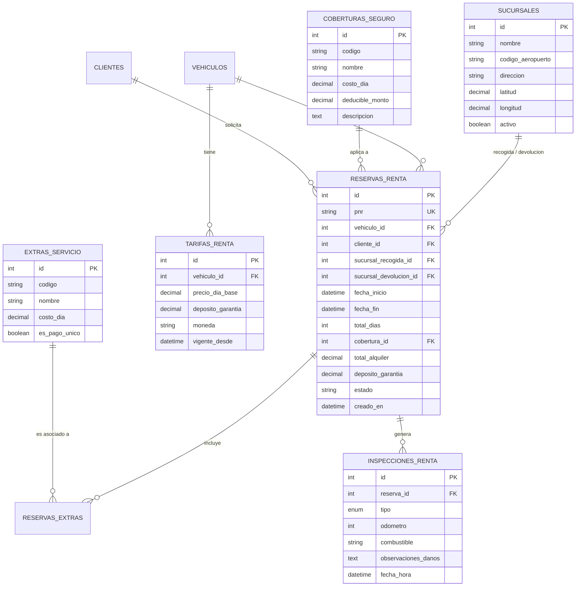

# PLAN DE IMPLEMENTACIÓN TÉCNICA (ROL: ANALISTA DE SISTEMAS)

**Proyecto:** Humberto Car Rental (Transformación Digital Car Rental Web)  
**Rol:** Analista de Sistemas / System Architect  
**Fecha:** Septiembre 2026  
**Entorno Tecnológico:** Next.js 16 (React 19, TypeScript, Tailwind, shadcn/ui) + Python Flask 3 (SQLAlchemy, MySQL)  

---

## User Review Required

> [!IMPORTANT]
> **Decisión de Migración de Base de Datos y Modelo de Negocio:**  
> Se implementará la **Estrategia Híbrida/Evolutiva**:
> - Se preservarán las tablas existentes de la concesionaria (`marcas`, `modelos`, `usuarios`, `clientes`) para no romper datos históricos.
> - Se crearán nuevas entidades especializadas para Renta: `sucursales`, `tarifas_renta`, `coberturas_seguro`, `extras_servicio`, `reservas_renta` y `inspecciones_renta`.
> - Se agregará a `vehiculos` el campo `disponible_para` (`ENUM('VENTA', 'RENTA', 'AMBOS')`) y atributos de renta (pasajeros, maletas grandes, maletas pequeñas, aire acondicionado).

> [!WARNING]
> **Pasarela de Pagos vs. Flujo Mostrador (Voucher Garantizado):**  
> Para la Fase 1 del MVP, siguiendo el estándar de Kayak y Rentcars en República Dominicana, la confirmación se realizará mediante **Voucher Garantizado con Pago y Depósito de Garantía en Mostrador (Pay at Pick-up)**, con validación de tarjeta de crédito al retirar. La integración con pasarela de cobro tokenizada (ej. CardNet / Stripe) se estructurará como fase subsecuente.

---

## 1. EVALUACIÓN Y ESPECIFICACIÓN POR HISTORIA DE USUARIO

---

### HISTORIA DE USUARIO 1: Motor de Búsqueda y Disponibilidad por Rango de Fechas y Sucursales

#### 1. Ficha de la Historia
* **ID:** `US-RENT-01`
* **Épica:** `EPIC 1: Motor de Búsqueda y Disponibilidad por Calendario`
* **Historia:**  
  *Como* cliente que visita la plataforma web,  
  *quiero* seleccionar el lugar de recogida/devolución y el rango de fechas y horas de mi alquiler,  
  *para* consultar únicamente los vehículos que tienen disponibilidad real en ese período y conocer la cantidad exacta de días facturables.

#### 2. Objetivo Técnico y Funcional
Implementar un widget de búsqueda interactivo en el home y cabecera, respaldado por un endpoint de backend que realice la verificación de colisiones en el calendario (`NOT EXISTS` o exclusión de intervalos solapados) entre las reservas confirmadas/en curso y las unidades de la flota activa para renta.

#### 3. Requisitos Mínimos del Entregable (Definition of Done)
1. **Entidad de Sucursales:** Tabla `sucursales` en MySQL con soporte para Santo Domingo (Aeropuerto Las Américas AILA - SDQ, Santo Domingo Centro / Piantini, etc.).
2. **Algoritmo de Colisión Temporal en SQL:**
   - La unidad está disponible si **NO** existe una reserva con estado `CONFIRMADA` o `EN_CURSO` donde:
     $$\text{reserva.fecha\_inicio} < \text{nueva\_fecha\_fin} \quad \text{AND} \quad \text{reserva.fecha\_fin} > \text{nueva\_fecha\_inicio}$$
3. **Cálculo de Días Facturables:** Regla estándar de 24 horas. Si la diferencia horaria supera un margen de gracia de 59 minutos, se computa un día adicional:
   $$\text{días} = \lceil (\text{fecha\_fin} - \text{fecha\_inicio} - 59\text{min}) / 24\text{h} \rceil$$
4. **Widget Frontend:** Componente de selección con Date-Time Pickers, validación de fecha de recogida $\ge$ fecha actual + 2 horas, y duración mínima de 24 horas.

#### 4. Módulos a Modificar
* **Backend:**
  - `backend/models/geo.py` y `models/transactions.py`: Creación del modelo `Sucursal` y adaptación de `ReservaRenta`.
  - `backend/blueprints/catalog.py`: Creación del endpoint `GET /api/catalogo/disponibilidad`.
* **Frontend:**
  - `frontend/components/rental-search-widget.tsx`: Componente de búsqueda por fechas y sucursales.
  - `frontend/app/page.tsx`: Inserción del widget en la sección Hero principal.
  - `frontend/lib/api.ts` y `lib/types.ts`: Tipos y cliente API para consulta de disponibilidad.

#### 5. Alcance (Scope)
* **In Scope:** Sucursal de recogida, sucursal de devolución (misma o diferente sede), fecha/hora de recogida, fecha/hora de devolución, cálculo automático de días de alquiler, validaciones temporales.
* **Out of Scope:** Vuelos en tiempo real (Flight tracking), selector de edad del conductor en el buscador inicial (se maneja en checkout).

---

### HISTORIA DE USUARIO 2: Catálogo de Flota con Tarificación Diaria y Categorías ACRISS

#### 1. Ficha de la Historia
* **ID:** `US-RENT-02`
* **Épica:** `EPIC 2: Rediseño del Catálogo con Tarificación Diaria y Categorías de Flota`
* **Historia:**  
  *Como* usuario en búsqueda de alquiler,  
  *quiero* ver el listado de vehículos disponibles filtrados por categoría, transmisión y capacidad de equipaje, mostrando la tarifa diaria y el costo total del período,  
  *para* seleccionar la opción que mejor se ajuste a mi presupuesto y volumen de equipaje.

#### 2. Objetivo Técnico y Funcional
Transformar la visualización del catálogo para reemplazar los precios de venta por un motor de cálculo dinámico de tarifas diarias por categoría/vehículo, incorporando indicadores estandarizados de capacidad (pasajeros, maletas grandes, maletas de mano) y badges de beneficios (kilometraje ilimitado, política lleno-a-lleno).

#### 3. Requisitos Mínimos del Entregable (Definition of Done)
1. **Esquema de Tarifas:** Tabla `tarifas_renta` asociada al vehículo o modelo con: `precio_dia_base`, `deposito_garantia`, `moneda` (USD y DOP).
2. **Atributos de Renta en Vehículos:** Campos `pasajeros` (smallint), `maletas_grandes` (smallint), `maletas_pequenas` (smallint), `tiene_aire_acondicionado` (boolean).
3. **Respuesta de API Enriquecida:** El endpoint del catálogo calcula y retorna para cada ítem:
   - `precio_por_dia`
   - `total_dias`
   - `precio_total_estimado`
   - `deposito_garantia_sugerido`
4. **Filtros de Catálogo Frontend:** Filtros por categoría de flota (Económico, Compacto, Intermedio, SUV, Van/Familiar), tipo de transmisión y capacidad de maletas.

#### 4. Módulos a Modificar
* **Backend:**
  - `backend/models/catalog.py`: Ampliación de `Vehiculo` con atributos de capacidad y relación con `TarifaRenta`.
  - `backend/blueprints/catalog.py`: Modificación del endpoint `GET /api/catalogo/vehiculos` para aceptar parámetros `fecha_inicio`, `fecha_fin` y calcular tarifas dinámicas.
* **Frontend:**
  - `frontend/components/vehicle-catalog.tsx`: Adaptación para renderizar tarjetas de renta.
  - `frontend/components/grouped-vehicle-card.tsx` / `rental-vehicle-card.tsx`: Nueva tarjeta con métricas de renta (días, precio/día, maletas, total).
  - `frontend/components/vehicle-filters.tsx`: Filtros de capacidad y categoría de renta.

#### 5. Alcance (Scope)
* **In Scope:** Categorías de flota, tarifas base por día, cálculo de total por período, badges informativos (Lleno a Lleno, Kilometraje Ilimitado).
* **Out of Scope:** Tarifas con descuentos por códigos promocionales o cupones (fase 2).

---

### HISTORIA DE USUARIO 3: Ficha de Vehículo, Coberturas de Seguro y Servicios Adicionales

#### 1. Ficha de la Historia
* **ID:** `US-RENT-03`
* **Épica:** `EPIC 3: Flujo de Selección de Coberturas, Seguros y Servicios Adicionales`
* **Historia:**  
  *Como* cliente que ha seleccionado un vehículo,  
  *quiero* configurar el nivel de cobertura/seguro y agregar servicios adicionales (silla de infante, Paso Rápido, conductor adicional),  
  *para* conocer con exactitud el nivel de protección, el depósito de garantía que me retendrán en mostrador y el precio final de mi orden.

#### 2. Objetivo Técnico y Funcional
Crear el paso intermedio de personalización del alquiler donde se presentan 3 niveles estandarizados de cobertura de seguro y un catálogo de servicios opcionales, con cálculo reactivo del total y del depósito de seguridad requerido.

#### 3. Requisitos Mínimos del Entregable (Definition of Done)
1. **Entidades de Coberturas y Extras:**
   - Tabla `coberturas_seguro`: `nombre` (Básica TPL, Estándar CDW, Cobertura Total), `descripcion`, `costo_dia`, `reduccion_deposito_pct`, `deducible_monto`.
   - Tabla `extras_servicio`: `nombre` (Silla de bebé, Dispositivo Paso Rápido peajes, Conductor Adicional, Wi-Fi Portátil), `costo_dia`, `es_pago_unico`.
2. **Endpoints de Catálogo de Opciones:**
   - `GET /api/renta/coberturas`
   - `GET /api/renta/extras`
3. **Página/Sección de Personalización:**
   - Vista en Next.js con tabla comparativa de coberturas destacando: Daños a Terceros (TPL), Robo/Colisión (CDW), Cero Deducible y monto del depósito de garantía en tarjeta.
   - Lista interactiva de checkboxes de extras con impacto instantáneo en el resumen de orden.

#### 4. Módulos a Modificar
* **Backend:**
  - `backend/models/transactions.py`: Creación de `CoberturaSeguro`, `ExtraServicio` y tabla intermedia `ReservaExtra`.
  - `backend/blueprints/catalog.py` o nuevo blueprint `blueprints/renta.py`.
* **Frontend:**
  - `frontend/app/renta/[id]/opciones/page.tsx` o integración en `app/vehiculo/[id]/page.tsx`.
  - `frontend/components/coverage-selector.tsx`: Selector de seguros.
  - `frontend/components/extras-selector.tsx`: Selector de adicionales.
  - `frontend/components/order-summary-card.tsx`: Resumen flotante de la reserva.

#### 5. Alcance (Scope)
* **In Scope:** 3 niveles de coberturas, 4 extras principales de República Dominicana, cálculo dinámico de fianza/garantía y precio diario.
* **Out of Scope:** Seguros médicos o de viaje provistos por aseguradoras externas vía API en tiempo real.

---

### HISTORIA DE USUARIO 4: Proceso de Checkout Web, Registro del Conductor y Confirmación (Voucher PNR)

#### 1. Ficha de la Historia
* **ID:** `US-RENT-04`
* **Épica:** `EPIC 4: Proceso de Checkout Web, Registro del Conductor y Confirmación (Voucher)`
* **Historia:**  
  *Como* conductor principal,  
  *quiero* ingresar mis datos personales, licencia de conducir y confirmar mi reserva,  
  *para* recibir un comprobante digital (Voucher con código PNR) con todos los detalles de mi alquiler y las instrucciones de retiro.

#### 2. Objetivo Técnico y Funcional
Construir el formulario de checkout validando requisitos de elegibilidad (edad mínima $\ge$ 21 años, fecha de caducidad de licencia vigente), persistir la reserva atómicamente con generación de un código PNR alfanumérico único (ej. `HA-72941`) y emitir la vista de confirmación con voucher imprimible/PDF.

#### 3. Requisitos Mínimos del Entregable (Definition of Done)
1. **Validaciones de Negocio:**
   - Edad calculada a partir de la fecha de nacimiento $\ge 21$ años.
   - Si la edad está entre 21 y 24 años, inyección automática del recargo por conductor joven (*Young Driver Surcharge*).
   - Licencia de conducir con vigencia posterior a la fecha de devolución del vehículo.
2. **Generador de PNR (Passenger Name Record / Código de Reserva):**
   - Código único de 6 a 8 caracteres alfanuméricos en mayúsculas, indexado de forma única.
3. **Endpoint Transaccional:**
   - `POST /api/renta/reservas`: Inserta en una transacción atómica el registro de `ReservaRenta`, sus extras, bloquea la disponibilidad de fechas para la unidad y envía confirmación.
4. **Voucher Digital:**
   - Página `/renta/confirmacion/[pnr]` con desglose de itinerario (sucursales, fechas/horas), resumen financiero, documentos requeridos a presentar en mostrador y botón de impresión/PDF.

#### 4. Módulos a Modificar
* **Backend:**
  - `backend/models/transactions.py`: Definición de `ReservaRenta`.
  - `backend/blueprints/reservas.py` (o `renta.py`): Endpoint de creación y consulta por PNR.
* **Frontend:**
  - `frontend/app/renta/checkout/page.tsx`: Formulario de conductor y resumen de términos.
  - `frontend/app/renta/confirmacion/[pnr]/page.tsx`: Voucher de confirmación.
  - `frontend/components/voucher-card.tsx`: Ficha visual del voucher.

#### 5. Alcance (Scope)
* **In Scope:** Formulario de conductor, validación de edad y licencia, generación de PNR, voucher web y preparado para envío por WhatsApp / Correo.
* **Out of Scope:** Cobro automático vía pasarela con 3DSecure en este sprint (modalidad "Pagar al Retirar").

---

### HISTORIA DE USUARIO 5: Panel de Operaciones de Renta - Gestión de Reservas, Check-in y Check-out

#### 1. Ficha de la Historia
* **ID:** `US-RENT-05`
* **Épica:** `EPIC 6: Panel Administrativo de Operaciones (Check-in, Check-out, Inspección y Flota)`
* **Historia:**  
  *Como* agente de operaciones / administrador en la sucursal,  
  *quiero* buscar una reserva por su código PNR o cédula, registrar el Check-in (entrega del auto) y el Check-out (devolución del auto) con odómetro, combustible e inspección de daños,  
  *para* garantizar el control físico de la flota y la correcta devolución del depósito de garantía.

#### 2. Objetivo Técnico y Funcional
Desarrollar la consola administrativa de operaciones de alquiler de vehículos para gestionar el ciclo de vida de la reserva (`CONFIRMADA -> EN_CURSO / ENTREGADO -> COMPLETADA / DEVUELTO`), registrando actas de inspección física antes y después del servicio.

#### 3. Requisitos Mínimos del Entregable (Definition of Done)
1. **Entidad de Inspecciones:** Tabla `inspecciones_renta` con:
   - `tipo`: `ENTREGA` o `DEVOLUCION`
   - `odometro`: Kilometraje en tablero
   - `combustible`: Fracción (1/4, 1/2, 3/4, 8/8)
   - `observaciones_danos`: Detalle de rayones, abolladuras o estado de neumáticos
   - `foto_tablero_url`, `foto_vehiculo_url`
2. **Flujo de Check-in en Admin:**
   - Búsqueda instantánea por PNR.
   - Validación física de licencia y tarjeta de crédito para fianza.
   - Registro de inspección de salida $\rightarrow$ El vehículo cambia su estado operativo a `EN_RENTA`.
3. **Flujo de Check-out en Admin:**
   - Registro de odómetro y combustible de entrada.
   - Cálculo automático de penalidades si falta combustible o hay horas de retraso.
   - Cierre de reserva a `COMPLETADA` y orden de liberación de fianza.

#### 4. Módulos a Modificar
* **Backend:**
  - `backend/models/transactions.py`: Tabla `inspecciones_renta`.
  - `backend/blueprints/admin.py`: Endpoints `/api/admin/renta/reservas`, `/api/admin/renta/check-in`, `/api/admin/renta/check-out`.
* **Frontend:**
  - `frontend/app/admin/renta/page.tsx`: Tablero de reservas de alquiler (próximas entregas, autos en uso, devoluciones de hoy).
  - `frontend/app/admin/renta/[id]/inspeccion/page.tsx`: Formulario de inspección móvil para patio.

#### 5. Alcance (Scope)
* **In Scope:** Búsqueda por PNR, formulario de check-in y check-out, registro de kilometraje y nivel de combustible, cambio de estado de reserva.
* **Out of Scope:** Firma digital biométrica en tableta (fase 2).

---

## 2. DISEÑO TÉCNICO DE BASE DE DATOS (DATA MODEL)

### Diagrama Entidad-Relación Propuesto



---

## 3. ESPECIFICACIÓN DE ENDPOINTS REST (API CONTRACTS)

### 1. Consultar Disponibilidad y Tarifas
* **Ruta:** `GET /api/renta/disponibilidad`
* **Parámetros Query:**
  - `fecha_inicio`: ISO 8601 (ej. `2026-10-01T10:00:00`)
  - `fecha_fin`: ISO 8601 (ej. `2026-10-05T10:00:00`)
  - `sucursal_recogida_id`: Entero (ej. `1`)
  - `sucursal_devolucion_id`: Entero (ej. `1`)
  - `categoria`: Opcional (ej. `SUV`)
* **Respuesta Exitosa (200 OK):**
```json
{
  "dias_facturables": 4,
  "fecha_inicio": "2026-10-01T10:00:00",
  "fecha_fin": "2026-10-05T10:00:00",
  "total_disponibles": 8,
  "vehiculos": [
    {
      "id": 14,
      "marca": "TOYOTA",
      "modelo": "RAV4",
      "categoria": "SUV",
      "anio": 2024,
      "transmision": "AUTOMATICA",
      "pasajeros": 5,
      "maletas_grandes": 2,
      "maletas_pequenas": 2,
      "aire_acondicionado": true,
      "kilometraje_ilimitado": true,
      "politica_combustible": "LLENO_A_LLENO",
      "tarifa": {
        "precio_por_dia": 55.00,
        "moneda": "USD",
        "total_estimado": 220.00,
        "deposito_garantia_base": 800.00
      },
      "imagenes": ["/api/uploads/images/rav4_front.webp"]
    }
  ]
}
```

### 2. Crear Reserva de Renta (Checkout)
* **Ruta:** `POST /api/renta/reservas`
* **Body Request:**
```json
{
  "vehiculo_id": 14,
  "sucursal_recogida_id": 1,
  "sucursal_devolucion_id": 1,
  "fecha_inicio": "2026-10-01T10:00:00",
  "fecha_fin": "2026-10-05T10:00:00",
  "cobertura_id": 2,
  "extras_ids": [1, 3],
  "conductor": {
    "nombre": "Carlos",
    "apellido": "Gomez",
    "email": "carlos.gomez@gmail.com",
    "telefono": "+18095550192",
    "documento_tipo": "PASAPORTE",
    "documento_numero": "A1928374",
    "licencia_numero": "DO-829102",
    "licencia_pais": "DO",
    "fecha_nacimiento": "1995-04-12"
  },
  "notas_vuelo": "Vuelo JetBlue 1923"
}
```
* **Respuesta Exitosa (201 Created):**
```json
{
  "mensaje": "Reserva confirmada con éxito",
  "reserva": {
    "pnr": "HA-39201",
    "estado": "CONFIRMADA",
    "total_dias": 4,
    "total_alquiler": 312.00,
    "deposito_garantia_requerido": 400.00,
    "moneda": "USD",
    "instrucciones_retiro": "Presentar este voucher, pasaporte, licencia vigente y tarjeta de crédito en el mostrador del Aeropuerto Las Américas (SDQ)."
  }
}
```

---

## 4. PROPOSED CHANGES (PLAN DE ARCHIVOS Y COMPONENTES)

### Backend Architecture (`backend/backend/`)

#### [NEW] [models/renta.py](file:///c:/Users/jeanm/Desktop/humberto-dealer/backend/backend/models/renta.py)
- Modelos: `Sucursal`, `TarifaRenta`, `CoberturaSeguro`, `ExtraServicio`, `ReservaRenta`, `ReservaExtra`, `InspeccionRenta`.

#### [MODIFY] [models/catalog.py](file:///c:/Users/jeanm/Desktop/humberto-dealer/backend/backend/models/catalog.py)
- Agregar columnas a `Vehiculo`: `disponible_para` (VENTA, RENTA, AMBOS), `pasajeros`, `maletas_grandes`, `maletas_pequenas`, `tiene_aire_acondicionado`.

#### [NEW] [blueprints/renta.py](file:///c:/Users/jeanm/Desktop/humberto-dealer/backend/backend/blueprints/renta.py)
- Endpoints públicos de renta:
  - `GET /api/renta/sucursales`
  - `GET /api/renta/disponibilidad`
  - `GET /api/renta/coberturas`
  - `GET /api/renta/extras`
  - `POST /api/renta/reservas`
  - `GET /api/renta/reservas/<pnr>`

#### [MODIFY] [blueprints/admin.py](file:///c:/Users/jeanm/Desktop/humberto-dealer/backend/backend/blueprints/admin.py)
- Endpoints de operaciones de mostrador:
  - `GET /api/admin/renta/reservas`
  - `POST /api/admin/renta/check-in`
  - `POST /api/admin/renta/check-out`

#### [MODIFY] [__init__.py](file:///c:/Users/jeanm/Desktop/humberto-dealer/backend/backend/__init__.py)
- Registrar blueprint `renta_bp` con prefijo `/api/renta`.

---

### Frontend Architecture (`frontend/`)

#### [NEW] [components/rental-search-widget.tsx](file:///c:/Users/jeanm/Desktop/humberto-dealer/frontend/components/rental-search-widget.tsx)
- Widget interactivo con sucursales, date pickers, selector de horas y botón de búsqueda.

#### [NEW] [components/rental-vehicle-card.tsx](file:///c:/Users/jeanm/Desktop/humberto-dealer/frontend/components/rental-vehicle-card.tsx)
- Tarjeta de vehículo con desglose de días, tarifa diaria, total, capacidad de maletas y botón de selección.

#### [NEW] [app/renta/disponibilidad/page.tsx](file:///c:/Users/jeanm/Desktop/humberto-dealer/frontend/app/renta/disponibilidad/page.tsx)
- Página de resultados de búsqueda de renta con filtros laterales por categoría y transmisión.

#### [NEW] [app/renta/checkout/page.tsx](file:///c:/Users/jeanm/Desktop/humberto-dealer/frontend/app/renta/checkout/page.tsx)
- Pantalla de Checkout con selección de cobertura, extras opcionales, datos del conductor y validaciones.

#### [NEW] [app/renta/confirmacion/[pnr]/page.tsx](file:///c:/Users/jeanm/Desktop/humberto-dealer/frontend/app/renta/confirmacion/[pnr]/page.tsx)
- Voucher descargable/imprimible con itinerario completo y requisitos de retiro.

#### [NEW] [app/admin/renta/page.tsx](file:///c:/Users/jeanm/Desktop/humberto-dealer/frontend/app/admin/renta/page.tsx)
- Tablero de operaciones para check-in/check-out en patio/mostrador.

#### [MODIFY] [components/header.tsx](file:///c:/Users/jeanm/Desktop/humberto-dealer/frontend/components/header.tsx)
- Navegación superior con selector o pestaña entre "Renta de Autos" y "Venta de Vehículos".

---

## 5. VERIFICATION PLAN

### Automated Tests
1. **Test de Algoritmo de Disponibilidad y Colisiones:**
   - Comando: `pytest backend/tests/test_renta_disponibilidad.py -v`
   - Validar que dos reservas no puedan solaparse en la misma unidad vehicular.
   - Validar cálculo de días facturables (ej. 24h 30m = 1 día; 25h 05m = 2 días).
2. **Test de Validaciones de Conductor y PNR:**
   - Comando: `pytest backend/tests/test_renta_checkout.py -v`
   - Validar rechazo de conductores menores de 21 años (HTTP 422).
   - Validar unicidad y formato del código PNR generado.
3. **Frontend Lint & Build:**
   - Comando: `npm run lint` y `npm run build` en `frontend/`.

### Manual Verification
1. **Flujo de Búsqueda Web:**
   - Ingresar a la home, seleccionar "Aeropuerto Las Américas", rango de 3 días y presionar "Buscar".
   - Confirmar que los resultados muestran tarifa/día y total calculado exactamente por 3 días.
2. **Flujo de Personalización y Checkout:**
   - Seleccionar un auto, cambiar de cobertura "Básica" a "Protección Total" y verificar que el depósito en pantalla disminuye y el total aumenta.
   - Completar formulario de conductor y enviar reserva.
   - Verificar la redirección al Voucher `/renta/confirmacion/[pnr]`.
3. **Flujo Operativo de Check-in en Panel Admin:**
   - Entrar con credenciales de `ADMIN`, buscar el PNR recién creado.
   - Completar Check-in con odómetro y combustible $\rightarrow$ Verificar que el estado cambia a `EN_CURSO`.
