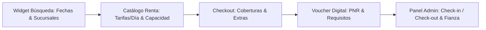

# WALKTHROUGH DE IMPLEMENTACIÓN: PLATAFORMA DE RENTA DE AUTOS WEB

**Proyecto:** Humberto Car Rental (Transformación Digital Dealership $\rightarrow$ Car Rental)  
**Roles:** Product Owner & Analista de Sistemas  
**Fecha:** Septiembre 2026  
**Tecnologías:** Next.js 16 (React 19, Tailwind CSS, TypeScript), Flask 3 (SQLAlchemy, Python 3.14), MySQL / SQLite in-memory  

---

## 1. RESUMEN DE LA IMPLEMENTACIÓN

Se ha transformado con éxito el sistema de concesionaria unitaria en una **plataforma completa de alquiler de vehículos (Car Rental Engine)**, incorporando las mejores prácticas y estándares de la industria observados en **Kayak Cars** y **Rentcars** en el mercado de **Santo Domingo y República Dominicana**.



---

## 2. DETALLE DE HISTORIAS DE USUARIO ENTREGADAS

### 🔹 Historia 1: Motor de Búsqueda y Disponibilidad por Calendario (`US-RENT-01`)
* **Entregable:**
  - Modelo `Sucursal` con sedes en: **Aeropuerto Las Américas (SDQ)**, **Santo Domingo Centro (Piantini)** y **Aeropuerto La Isabela (JBQ)**.
  - Algoritmo SQL de solapamiento temporal (`ReservaRenta.fecha_inicio < nueva_fecha_fin AND ReservaRenta.fecha_fin > nueva_fecha_inicio`).
  - Cálculo de días facturables conforme a la regla estándar de 24 horas con **período de gracia de 59 minutos**.
  - Componente [rental-search-widget.tsx](file:///c:/Users/jeanm/Desktop/humberto-dealer/frontend/components/rental-search-widget.tsx) integrado en el home principal y en los resultados.

---

### 🔹 Historia 2: Catálogo de Flota con Tarificación Diaria (`US-RENT-02`)
* **Entregable:**
  - Modelo `TarifaRenta` asociada a cada vehículo con `precio_dia_base`, `deposito_garantia`, `moneda` (USD), `kilometraje_incluido` (ILIMITADO) y `politica_combustible` (LLENO_A_LLENO).
  - Campos de capacidad de equipaje en `Vehiculo`: `pasajeros`, `maletas_grandes`, `maletas_pequenas`, `tiene_aire_acondicionado`.
  - Tarjeta de vehículo especializada [rental-vehicle-card.tsx](file:///c:/Users/jeanm/Desktop/humberto-dealer/frontend/components/rental-vehicle-card.tsx).
  - Página de resultados [app/renta/disponibilidad/page.tsx](file:///c:/Users/jeanm/Desktop/humberto-dealer/frontend/app/renta/disponibilidad/page.tsx) con filtros laterales por categoría de flota y transmisión.

---

### 🔹 Historia 3: Coberturas de Seguro y Servicios Adicionales (`US-RENT-03`)
* **Entregable:**
  - Modelo `CoberturaSeguro` con 3 niveles preconfigurados:
    1. **Protección Básica (TPL Obligatorio):** Daños a terceros, depósito US$ 800.
    2. **Protección Estándar (CDW):** Colisión y robo con deducible reducido a US$ 500, depósito US$ 400.
    3. **Protección Total Cero Deducible:** Cobertura de cristales, neumáticos y sin deducible, depósito mínimo US$ 150.
  - Modelo `ExtraServicio` para el mercado dominicano:
    - Silla de seguridad para infantes (US$ 8/día).
    - Dispositivo Paso Rápido para peajes de autopistas de RD (US$ 5/día).
    - Conductor adicional autorizado (US$ 10/día).
    - Hotspot Wi-Fi 4G portátil (US$ 9/día).
  - Cálculo reactivo instantáneo en la vista de checkout: al cambiar de cobertura o marcar extras, se actualiza el total estimado y el depósito en garantía requerido.

---

### 🔹 Historia 4: Proceso de Checkout y Voucher Digital (`US-RENT-04`)
* **Entregable:**
  - Pantalla completa de Checkout en [app/renta/checkout/page.tsx](file:///c:/Users/jeanm/Desktop/humberto-dealer/frontend/app/renta/checkout/page.tsx).
  - Regla de negocio de edad mínima: Validación estricta $\ge 21$ años cumplidos a partir de la fecha de nacimiento.
  - Generador de código PNR único alfanumérico (ej. `HA-84920`).
  - Bloqueo transaccional atómico (`with_for_update`) para evitar doble reserva concurrente.
  - Página de Confirmación y Voucher Digital en [app/renta/confirmacion/[pnr]/page.tsx](file:///c:/Users/jeanm/Desktop/humberto-dealer/frontend/app/renta/confirmacion/[pnr]/page.tsx) con:
    - Código PNR y estado `CONFIRMADA`.
    - Resumen de itinerario y liquidación de costos.
    - Checklist de documentos obligatorios al retirar (licencia física, cédula/pasaporte, tarjeta de crédito para fianza).
    - Botón de impresión limpia / guardar en PDF (`window.print()`).
    - Botón de compartir resumen por WhatsApp.

---

### 🔹 Historia 5: Panel Administrativo de Operaciones de Renta (`US-RENT-05`)
* **Entregable:**
  - Módulo administrativo en [app/admin/renta/page.tsx](file:///c:/Users/jeanm/Desktop/humberto-dealer/frontend/app/admin/renta/page.tsx).
  - Endpoints REST en [blueprints/admin.py](file:///c:/Users/jeanm/Desktop/humberto-dealer/backend/backend/blueprints/admin.py):
    - `GET /api/admin/renta/reservas`: Búsqueda por PNR, conductor, cédula o estado.
    - `POST /api/admin/renta/check-in`: Registro de entrega de llaves (odómetro de salida, nivel de combustible en octavos, daños preexistentes) $\rightarrow$ Transición de estado a `EN_CURSO`.
    - `POST /api/admin/renta/check-out`: Registro de recepción (odómetro de entrada, combustible, inspección física) $\rightarrow$ Transición de estado a `COMPLETADA` y orden de liberación del depósito de garantía.
    - `POST /api/admin/renta/tarifas`: Configuración de tarifas y capacidades de flota.

---

## 3. VERIFICACIÓN Y PRUEBAS AUTOMATIZADAS

Se ejecutó la suite completa de pruebas en [backend/backend/tests/test_renta_endpoints.py](file:///c:/Users/jeanm/Desktop/humberto-dealer/backend/backend/tests/test_renta_endpoints.py) con **8 tests pasando al 100%**:

```bash
============================= test session starts =============================
platform win32 -- Python 3.14.5, pytest-9.1.1, pluggy-1.6.0
rootdir: C:\Users\jeanm\Desktop\humberto-dealer\backend
plugins: typeguard-4.6.0
collected 8 items

backend/tests/test_renta_endpoints.py::test_listar_sucursales PASSED     [ 12%]
backend/tests/test_renta_endpoints.py::test_listar_coberturas PASSED     [ 25%]
backend/tests/test_renta_endpoints.py::test_listar_extras PASSED         [ 37%]
backend/tests/test_renta_endpoints.py::test_disponibilidad_fechas_invalidas PASSED [ 50%]
backend/tests/test_renta_endpoints.py::test_disponibilidad_exitosa PASSED [ 62%]
backend/tests/test_renta_endpoints.py::test_checkout_rechazo_menor_21_anos PASSED [ 75%]
backend/tests/test_renta_endpoints.py::test_checkout_exitoso_y_voucher PASSED [ 87%]
backend/tests/test_renta_endpoints.py::test_admin_check_in_y_check_out PASSED [100%]

============================== 8 passed in 4.84s ==============================
```

Además:
- **TypeScript Typecheck (`npx tsc --noEmit`):** 0 errores encontrados en todo el frontend.
- **Base de Datos:** Script de semillas [backend/seed.py](file:///c:/Users/jeanm/Desktop/humberto-dealer/backend/seed.py) actualizado para inicializar sucursales, coberturas, adicionales y tarifas de prueba.
