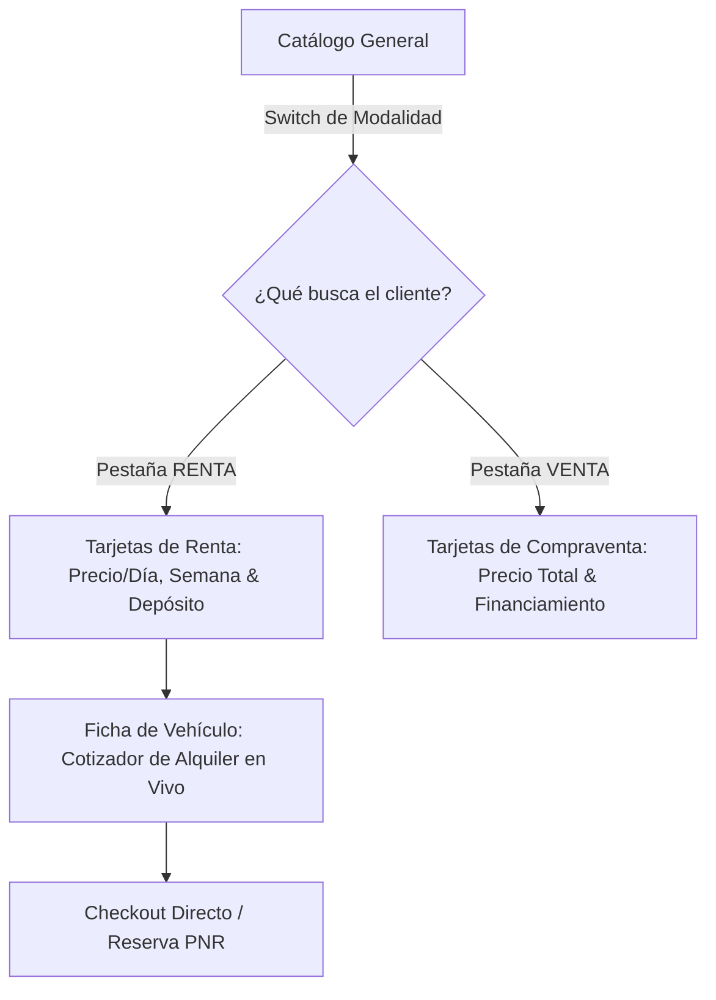

# PLAN DE REFACTORIZACIÓN FUNCIONAL Y FLUJOS UX/UI: VISUALIZACIÓN DE RENTA EN INTERFAZ

**Proyecto:** Humberto Auto Import & Car Rental  
**Rol:** Product Owner & Lead UX/System Analyst  
**Fecha:** Septiembre 2026  
**Objetivo:** Extender la visibilidad de la lógica de negocio de renta de vehículos a nivel de toda la interfaz pública (Catálogo, Tarjetas de Vehículos, Filtros y Ficha de Detalle).  

---

## 1. DIAGNÓSTICO DEL PROBLEMA VISUAL Y FUNCIONAL

### Situación Detectada en la Captura
Al inspeccionar la captura del usuario y el código de la vista principal:

> [!WARNING]
> **Brecha de Visibilidad (UI Gap):**  
> Aunque los endpoints de backend (`/api/renta/*`), las tablas de base de datos (`tarifas_renta`, `sucursales`, etc.) y las páginas dedicadas (`/renta/disponibilidad`, `/renta/checkout`) están operativas, **el catálogo principal del sitio (`components/vehicle-catalog.tsx`), las tarjetas de autos (`vehicle-card.tsx`, `grouped-vehicle-card.tsx`) y la ficha de detalle (`app/vehiculo/[id]/page.tsx`) continúan funcionando exclusivamente bajo el modelo de concesionaria de venta.**

```
[Captura del Usuario]
┌────────────────────────────────────────────────────────┐
│ Catálogo de Vehículos (Vista Actual)                   │
├─────────────────────────┬──────────────────────────────┤
│ FILTROS LATERALES       │ TARJETAS DE AUTOS            │
│ • Precio: $5,000-$100,000│ • CHEVROLET TRAX 2017        │
│   (Solo precio venta)   │   Precio: US$ 13,900 (Venta) │
│ • Tipo, Combustible...  │   Sin costo por día/semana   │
│ • Sin fechas ni renta   │   Botón: "Ver Detalles"      │
└─────────────────────────┴──────────────────────────────┘
```

### Causas Raíz Identificadas
1. **Desacoplamiento del Serializer de Catálogo:**  
   El endpoint `GET /api/catalogo/vehiculos` y el modelo frontend `Vehicle` solo exponen `precio` (precio de compraventa en DOP/USD). No incluyen en su payload el objeto `tarifa_renta` (`precio_dia_base`, `deposito_garantia`, `moneda`).
2. **Ausencia de Selector de Modalidad (Modo Renta vs. Modo Venta):**  
   El catálogo principal no ofrece una pestaña o switch que permita al usuario alternar entre **"Renta de Vehículos"** y **"Venta de Vehículos"**.
3. **Tarjetas de Vehículo Monolíticas:**  
   `VehicleCard` y `GroupedVehicleCard` formatean únicamente el valor `vehicle.precio` como precio total de compra. No muestran tarifas por día (ej. `US$ 45 / día`), tarifa semanal estimada ni el depósito en garantía requerido.
4. **Ficha de Detalle Aislada de Renta (`/vehiculo/[id]`):**  
   Al abrir un vehículo específico, el usuario solo ve el botón para "Comprar / Apartar" y "WhatsApp de Venta", sin un cotizador integrado por fechas de alquiler.

---

## 2. PROPUESTA DE REFACTOR FUNCIONAL (TO-BE)

Para resolver esto sin perder la funcionalidad de venta existente (modelo híbrido de alta rentabilidad), se proponen **4 pilares de transformación funcional**:



---

## 3. ESPECIFICACIÓN DETALLADA DE FLUJOS DE USUARIO

### Flujo 1: Selector de Modalidad Dual en el Catálogo (Home & Catálogo)
* **Ubicación:** Encima de la grilla de vehículos en `components/vehicle-catalog.tsx`.
* **Diseño:** Selector tipo Tabs o Segmented Control con badges llamativos:
  - **Tab 1: 🚗 Renta de Vehículos (Por Día / Semana)** *(Activo por defecto o según preferencia)*
  - **Tab 2: 🏷️ Compra de Vehículos (Venta Directa)**
* **Comportamiento:**
  - Al seleccionar **"Renta"**:
    - Las tarjetas de vehículos alternan instantáneamente su presentación a tarifas de alquiler.
    - Se habilita una barra de rango de fechas en la cabecera del catálogo.
    - Los filtros laterales se reconfiguran para mostrar:
      - Rango de precio diario: `US$ 25 - US$ 150 / día`.
      - Capacidad de pasajeros: `2 a 7+ asientos`.
      - Capacidad de maletas: `1 a 4+ maletas`.
      - Transmisión: Automática / Manual.
  - Al seleccionar **"Venta"**:
    - Se mantiene el formato tradicional de compraventa (precios de $5,000 a $100,000, kilometraje total acumulado, etc.).

---

### Flujo 2: Rediseño de la Tarjeta de Vehículo (`VehicleCard` y `GroupedVehicleCard`)
En modo Renta (o en modo híbrido), cada tarjeta de auto debe mostrar:

```
┌────────────────────────────────────────────────────────┐
│ [ IMAGEN VEHÍCULO ]          [ BADGE: SUV / COMPACTO ] │
├────────────────────────────────────────────────────────┤
│ TOYOTA RAV4 2024                                       │
│                                                        │
│ ┌───────────────────────────┐ ┌──────────────────────┐ │
│ │ TARIFA POR DÍA            │ │ TARIFA SEMANAL (7d)  │ │
│ │ US$ 55 / día              │ │ US$ 330 / semana     │ │
│ │ (-15% por semana)         │ │ (Ahorra US$ 55)      │ │
│ └───────────────────────────┘ └──────────────────────┘ │
│                                                        │
│ 👥 5 Pasajeros   🧳 2 Maletas G.   💼 2 Maletas P.     │
│ 🛡️ Seguro TPL incluido   🔄 Km Ilimitado en RD        │
│ 💳 Depósito de garantía en mostrador: US$ 500          │
│                                                        │
│ [ Botón: Ver Disponibilidad / Cotizar Fechas ]         │
└────────────────────────────────────────────────────────┘
```

#### Reglas de Visualización de Precios:
1. **Tarifa Diaria Base:** Valor `tarifa.precio_dia_base` (ej. `US$ 55 / día`).
2. **Tarifa Semanal con Descuento:** Cálculo automático para 7 días aplicando tarifa preferencial (ej. 7 días al precio de 6 días o descuento del 15%).
3. **Depósito Requerido Visible:** Transparencia total sobre la fianza requerida en tarjeta al retirar (estándar Rentcars / Kayak).
4. **Modalidad Híbrida:** Si un vehículo está disponible para ambas cosas (`AMBOS`), la tarjeta muestra:
   - *Renta desde: US$ 55/día*
   - *Venta: US$ 24,500*

---

### Flujo 3: Ficha de Detalle de Vehículo (`/vehiculo/[id]`) con Cotizador de Renta
En la página individual del auto, en lugar de un único botón de "Apartar Venta", se estructura un panel lateral interactivo con dos pestañas o acordeón:

#### Pestaña A: "Alquilar este Auto" (Car Rental Engine)
* **Selectores integrados en la misma página:**
  - Selector de Sucursal de Retiro y Devolución (SDQ Aeropuerto, Piantini, JBQ).
  - Date-Time Picker de Recogida y Devolución.
* **Cálculo Reactivo en Tiempo Real:**
  - Cantidad de días calculados.
  - Subtotal alquiler (días $\times$ precio diario).
  - Selector rápido de seguro (Básico TPL, CDW, Total Protection).
  - Total a pagar y depósito en garantía.
* **Acción:** Botón **"Reservar Alquiler Inmediato"** $\rightarrow$ Transfiere directamente al Checkout con los datos precargados.

#### Pestaña B: "Comprar este Auto"
* Muestra el precio de venta final, simulador de cuotas de financiamiento y botón de apartado o contacto con asesor comercial.

---

### Flujo 4: Adaptación del Backend y Serializadores (Sin Breaking Changes)
Para que el frontend pueda renderizar estos precios sin hacer múltiples llamadas:

1. **Ampliación del Serializer de Vehículo (`Vehiculo.to_dict()` en `catalog.py`):**
   - Incorporar el bloque `tarifa_renta`:
     ```json
     "tarifa_renta": {
       "precio_dia_base": 55.0,
       "precio_semana_estimado": 330.0,
       "deposito_garantia": 500.0,
       "moneda": "USD",
       "kilometraje_incluido": "ILIMITADO",
       "politica_combustible": "LLENO_A_LLENO"
     },
     "disponible_para": "AMBOS",
     "pasajeros": 5,
     "maletas_grandes": 2,
     "maletas_pequenas": 2
     ```
2. **Actualización de Tipos TypeScript (`lib/types.ts`):**
   - Extender la interfaz `Vehicle` y `VehiculoAPI` para incluir opcionalmente `tarifa_renta`.

---

## 4. MATRIZ DE IMPACTO Y PLAN DE COMPONENTES A REFACTORIZAR

| Componente | Archivo | Modificación Funcional Propuesta |
| :--- | :--- | :--- |
| **Catálogo General** | `frontend/components/vehicle-catalog.tsx` | Añadir switch Renta/Venta; alternar lógica de visualización de precios. |
| **Tarjeta Individual** | `frontend/components/vehicle-card.tsx` | Mostrar tarifa/día, tarifa/semana, depósito y badges de equipaje/pasajeros. |
| **Tarjeta Agrupada** | `frontend/components/grouped-vehicle-card.tsx` | Mostrar rango de precios de renta ("Desde US$ 45/día") además del precio de venta. |
| **Filtros Laterales** | `frontend/components/vehicle-filters.tsx` | Añadir slider de precio por día ($25-$150) y filtros de capacidad para modo renta. |
| **Ficha de Detalle** | `frontend/app/vehiculo/[id]/page.tsx` | Incorporar widget cotizador de alquiler por fechas junto a la opción de compra. |
| **Backend Serializer** | `backend/backend/models/catalog.py` | Exponer relación `tarifa_renta` en el método `to_dict()`. |

---

## 5. BENEFICIOS CLAVE DEL REFACTOR
1. **Claridad Inmediata para el Cliente:** El visitante comprende al instante cuánto cuesta alquilar el vehículo por día o semana sin tener que iniciar un proceso a ciegas.
2. **Experiencia de Usuario Comparable a Kayak y Rentcars:** Desglose transparente de precio diario, semanal, políticas de combustible y fianza.
3. **Plataforma Integral 2 en 1:** Humberto Auto Import puede operar simultáneamente como **Dealer de Compraventa** y como **Car Rental**, maximizando el retorno del inventario sin fricciones.
