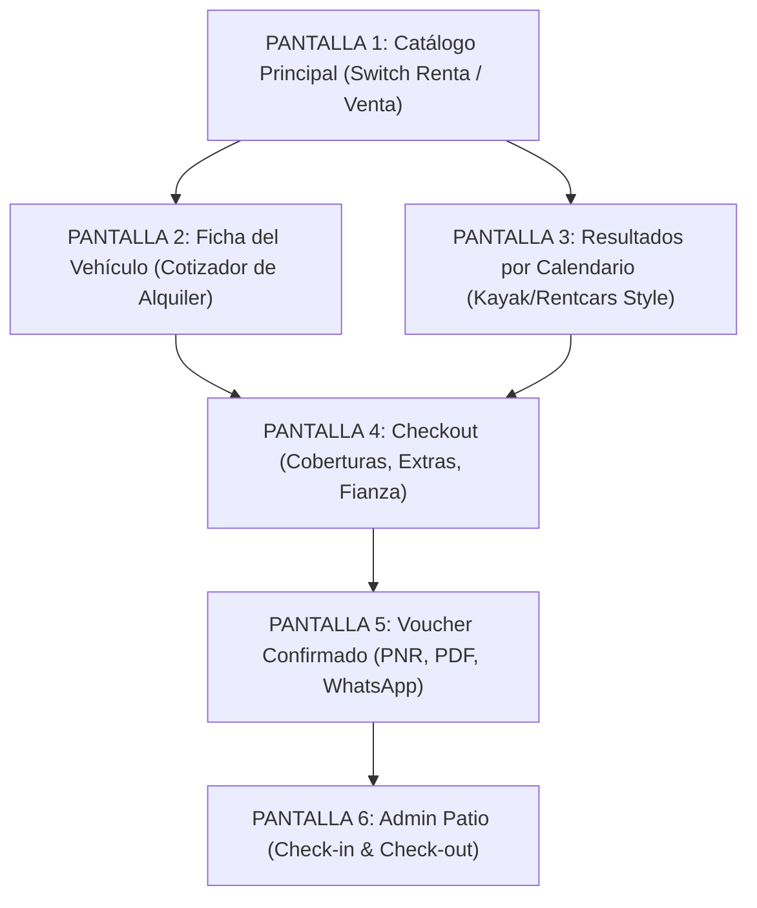

# PLAN MAESTRO DE REFACTORIZACIÓN POR PANTALLA: CAR RENTAL & DEALERSHIP DUAL

**Proyecto:** Humberto Auto Import & Car Rental  
**Rol:** Product Owner & Analista Senior de Sistemas  
**Fecha:** Septiembre 2026  
**Objetivo:** Especificar de forma independiente para **cada pantalla** del sistema las historias de usuario, solución del problema visual/funcional, reglas de validación y resultados esperados.

---

## ÍNDICE DE PANTALLAS EVALUADAS

1. **[PANTALLA 1]** Catálogo General y Home (`/`, `components/vehicle-catalog.tsx`, `grouped-vehicle-card.tsx`, `vehicle-card.tsx`)
2. **[PANTALLA 2]** Ficha de Detalle del Vehículo (`/vehiculo/[id]`, `/modelo/[id]`)
3. **[PANTALLA 3]** Resultados de Búsqueda por Calendario y Filtros de Renta (`/renta/disponibilidad`)
4. **[PANTALLA 4]** Checkout Web, Coberturas y Registro del Conductor (`/renta/checkout`)
5. **[PANTALLA 5]** Voucher Digital Oficial de Confirmación (`/renta/confirmacion/[pnr]`)
6. **[PANTALLA 6]** Consola de Operaciones de Patio y Mostrador (`/admin/renta`)

---

---

## PANTALLA 1: Catálogo General y Home
* **Ruta / Componentes:** `frontend/app/page.tsx`, `components/vehicle-catalog.tsx`, `components/vehicle-card.tsx`, `components/grouped-vehicle-card.tsx`, `components/vehicle-filters.tsx`.

### 1. Historia de Usuario (`US-UI-P1`)
> **Como** visitante de la web de Humberto Dealer,  
> **quiero** poder alternar entre ver autos en **Renta** o en **Venta**, y visualizar de inmediato el precio por día (ej. *US\$ 45 / día*), la tarifa semanal y el depósito en garantía,  
> **para** cotizar y comparar de inmediato sin tener que iniciar un proceso de reserva a ciegas ni confundirme con los precios de compraventa.

### 2. Problema Actual (Diagnóstico UI)
* En el catálogo actual (ver captura del usuario), los autos solo muestran precios totales de venta: *"CHEVROLET TRAX 2017 - US\$ 13,900"*, *"VOLKSWAGEN TOUAREG 2014 - US\$ 15,900"*.
* No existe ningún indicador de tarifa diaria (`/ día`) ni semanal.
* El filtro lateral filtra únicamente por precio de venta total (*\$5,000 a \$100,000*).
* No hay distinción clara entre qué autos se pueden alquilar y cuáles son exclusivos para venta.

### 3. Solución del Problema
1. **Switch Segmentado de Modalidad:**
   - Ubicado sobre el catálogo: `[🚗 Rentar Autos]` | `[🏷️ Comprar Autos]`.
2. **Transformación de Tarjetas (`VehicleCard` y `GroupedVehicleCard`):**
   - En **Modo Renta**:
     - Precio principal: **US\$ [XX] / día** en tipografía destacada.
     - Sub-tarifa: **US\$ [YY] / semana (7 días)** con badge *"Ahorra 15%"*.
     - Métricas de capacidad: Ícono de pasajeros (ej. 5), maletas grandes (2), maletas de mano (2) y transmisión.
     - Indicador de depósito: *"Depósito de garantía: US\$ [ZZZ]"*.
     - Badges de valor: *"Km Ilimitado en RD"* y *"Seguro TPL incluido"*.
     - Botón de acción: **"Rentar / Cotizar"** (naranja `#FF5500`).
   - En **Modo Venta**: Mantiene el precio total de venta tradicional (*RD\$ 850,000 / US\$ 14,500*), kilometraje recorrido y botón *"Ver detalles"*.
3. **Filtros Adaptativos (`VehicleFilters`):**
   - En Modo Renta, el slider de precios cambia de escala: de *US\$ 25* a *US\$ 200* por día.
   - Se activan checkboxes para capacidad de pasajeros (*2, 4, 5, 7+*) y maletas.

### 4. Reglas de Validación y Negocio
* **RV-P1-01:** Si un vehículo tiene modalidad `disponible_para = 'VENTA'`, no debe aparecer en el listado cuando el switch esté en `Renta`.
* **RV-P1-02:** Si un vehículo tiene `disponible_para = 'AMBOS'`, en modo Renta muestra la tarifa diaria como principal y en letra pequeña *"También en venta: US\$ [Precio]"*.
* **RV-P1-03:** El cálculo de la tarifa semanal se estandariza como $\text{Tarifa Semanal} = \text{Tarifa Diaria} \times 6$ (bonificando el 7mo día de alquiler).
* **RV-P1-04:** La moneda por defecto para tarifas de renta turística es `USD`, con conversión informativa a `DOP` según tasa de cambio configurada.

### 5. Resultado Esperado
* El usuario entra al Home, ve el switch activo en **"Renta de Autos"** y cada tarjeta exhibe:
  - *TOYOTA RAV4 2024* $\rightarrow$ **US\$ 55 / día** | **US\$ 330 / semana** | *Depósito: US\$ 500* | *5 Pasajeros* | *2 Maletas*.
  - Al presionar **"Rentar / Cotizar"**, se traslada a la ficha del vehículo con el cotizador interactivo.

---

## PANTALLA 2: Ficha de Detalle del Vehículo
* **Ruta / Componentes:** `frontend/app/vehiculo/[id]/page.tsx`, `frontend/app/modelo/[id]/page.tsx`.

### 1. Historia de Usuario (`US-UI-P2`)
> **Como** cliente interesado en un modelo específico,  
> **quiero** cotizar el alquiler directamente en la ficha del auto seleccionando mis fechas de recogida y devolución y la sucursal de retiro,  
> **para** conocer el importe exacto de mi viaje y pasar de inmediato al checkout con un solo clic.

### 2. Problema Actual (Diagnóstico UI)
* La ficha del vehículo solo presenta el precio de venta unitario (`RD$ 1,250,000`).
* Los únicos llamados a la acción son *"Apartar Vehículo"* (que bloquea la unidad para compra en el dealer) y *"Consultar por WhatsApp"*.
* No hay selector de fechas ni estimación de costo de alquiler por período.

### 3. Solución del Problema
1. **Panel Lateral Híbrido con Dos Pestañas:**
   - **Pestaña 1: "Alquilar este Auto" (Car Rental)**
     - Selector de sucursal de recogida y devolución (AILA SDQ, Piantini, JBQ).
     - Selectores de fecha y hora (Pick-up / Drop-off).
     - Desglose reactivo en vivo:
       - *Días facturables:* ej. 3 días.
       - *Tarifa base:* 3 días $\times$ US\$ 55 = US\$ 165.
       - *Depósito en tarjeta requerido:* US\$ 500.
       - *Kilometraje:* Ilimitado en todo el país.
     - Botón principal: **"Reservar Alquiler (Ir al Checkout)"** $\rightarrow$ Redirige a `/renta/checkout` con parámetros precargados.
   - **Pestaña 2: "Comprar este Auto" (Dealership)**
     - Precio total de venta, calculadora de cuotas de financiamiento y botón de apartado.
2. **Especificaciones de Renta Destacadas:**
   - Bloque de iconos: Asientos, maletas grandes, maletas de mano, aire acondicionado, tipo de combustible y transmisión.

### 4. Reglas de Validación y Negocio
* **RV-P2-01:** La fecha de devolución debe superar a la de recogida por al menos 24 horas.
* **RV-P2-02:** Si la unidad ya cuenta con una reserva confirmada en las fechas elegidas, el cotizador debe alertar en rojo: *"Este auto no está disponible para las fechas seleccionadas. Te sugerimos unidades similares de la categoría."*
* **RV-P2-03:** El selector de fechas debe calcular automáticamente si aplica tarifa diaria o descuento semanal si la estadía supera los 7 días.

### 5. Resultado Esperado
* En la ficha de un *Hyundai Tucson 2017*, el cliente selecciona *"Del 10 al 14 de Octubre en Aeropuerto Las Américas"* y la pantalla calcula en tiempo real:  
  **Total estimado: US\$ 180 (4 días a US\$ 45/día)** | **Depósito: US\$ 500** $\rightarrow$ Botón: **"Continuar con la Reserva"**.

---

## PANTALLA 3: Resultados de Búsqueda por Calendario y Filtros
* **Ruta / Componentes:** `frontend/app/renta/disponibilidad/page.tsx`, `components/rental-vehicle-card.tsx`, `components/rental-search-widget.tsx`.

### 1. Historia de Usuario (`US-UI-P3`)
> **Como** viajero con itinerario definido (ej. turista llegando por el Aeropuerto de Santo Domingo),  
> **quiero** ver solo la flota disponible para mi rango exacto de fechas, filtrando por categoría de vehículo (Sedán, SUV, Van) y ordenando por precio por día,  
> **para** reservar el vehículo más conveniente al estilo de plataformas internacionales como Kayak o Rentcars.

### 2. Problema Actual (Diagnóstico UI)
* Esta vista se creó recientemente, pero requería alineación completa con el catálogo principal y persistencia del itinerario en sesión.

### 3. Solución del Problema
1. **Barra Superior de Itinerario Fija:**
   - Muestra: Sucursal de Retiro $\rightarrow$ Sucursal de Devolución | Rango de Fechas | Días Facturables.
   - Botón *"Modificar Búsqueda"* que despliega el widget sin recargar la página.
2. **Tarjeta de Flota Especializada (`RentalVehicleCard`):**
   - Columna izquierda: Fotografía del vehículo con badge de categoría ACRISS (Económico, SUV, etc.).
   - Columna central: Capacidad de maletas grandes, pequeñas, pasajeros, transmisión y política "Lleno a Lleno".
   - Columna derecha: Tarifa diaria neta, Total por los días de búsqueda (con impuestos incluidos), Depósito en garantía requerido y botón **"Seleccionar Auto"**.
3. **Filtros Laterales Especializados:**
   - Filtro por Categoría: Sedán, SUV, Pickup, Van familiar.
   - Filtro por Transmisión: Automática, Manual.
   - Filtro por Rango de Precio Diario: Slider interactivo.

### 4. Reglas de Validación y Negocio
* **RV-P3-01:** Regla de 24 horas + 59 minutos: Si el cliente recoge a las 10:00 AM y devuelve a las 10:59 AM del día siguiente, se factura 1 solo día. Si devuelve a las 11:00 AM, se factura automáticamente el segundo día.
* **RV-P3-02:** Exclusión estricta de colisiones: El motor SQL no retorna unidades con solapamiento temporal en reservas activas.
* **RV-P3-03:** Estado vacío (*Zero State*): Si no hay vehículos disponibles, ofrecer botón para *"Buscar en otra sucursal cercana"* o *"Ajustar fechas"*.

### 5. Resultado Esperado
* Una grilla limpia donde cada unidad muestra el precio diario y el costo total de la estadía calculado al instante, idéntico a los resultados de Kayak Santo Domingo.

---

## PANTALLA 4: Checkout Web, Coberturas y Conductor
* **Ruta / Componentes:** `frontend/app/renta/checkout/page.tsx`.

### 1. Historia de Usuario (`US-UI-P4`)
> **Como** conductor principal,  
> **quiero** elegir mi nivel de seguro (TPL, CDW, Cero Deducible), añadir extras (Paso Rápido, silla de bebé) y registrar mis datos personales y de licencia,  
> **para** formalizar mi contrato de alquiler y conocer con total transparencia el depósito de garantía que presentaré en mostrador.

### 2. Problema Actual (Diagnóstico UI)
* El sistema previo solo permitía crear reservas de venta sin selección de seguros ni desglose de adicionales ni validación de edad mínima de 21 años.

### 3. Solución del Problema
1. **Paso 1 - Selector Comparativo de Coberturas:**
   - **Protección Básica (TPL Obligatorio):** Cubre daños a terceros según ley dominicana. Fianza en mostrador: US\$ 800. *(Incluido)*.
   - **Protección Estándar (CDW):** Reduce deducible por colisión y robo a US\$ 500. Fianza: US\$ 400. *(+US\$ 15/día)*.
   - **Protección Total Cero Deducible:** Sin franquicia, cubre cristales y neumáticos. Fianza: US\$ 150. *(+US\$ 28/día - Recomendado)*.
2. **Paso 2 - Extras y Servicios Adicionales:**
   - Checkboxes interactivos: Silla de bebé (+US\$ 8/día), Dispositivo **Paso Rápido** para autopistas dominicanas (+US\$ 5/día), Conductor adicional (+US\$ 10/día), Wi-Fi portátil (+US\$ 9/día).
3. **Paso 3 - Datos del Conductor y Validación de Edad:**
   - Formulario de conductor: Nombre, Apellido, Email, Teléfono, Cédula/Pasaporte, No. de Licencia y Fecha de Nacimiento.
4. **Columna Flotante de Resumen de Orden:**
   - Desglose: Alquiler auto + Cobertura + Extras = Total del Alquiler.
   - Monto en caja negra destacada: **Depósito de Garantía (Fianza)** a retener en la tarjeta física.

### 4. Reglas de Validación y Negocio
* **RV-P4-01 (Edad Mínima):** Conductor con edad $\ge 21$ años. Si la fecha de nacimiento arroja menos de 21 años, el sistema bloquea el botón y muestra alerta roja: *"Debes tener al menos 21 años cumplidos para rentar un auto en República Dominicana"*.
* **RV-P4-02 (Recargo Conductor Joven):** Si tiene entre 21 y 24 años, se aplica automáticamente la tasa de conductor joven (+US\$ 10/día).
* **RV-P4-03 (Bloqueo Atómico Pesimista):** Al hacer clic en "Confirmar Reserva", se aplica `with_for_update` en la base de datos para impedir que dos personas reserven el mismo auto al mismo segundo.

### 5. Resultado Esperado
* Un proceso fluido en 3 pasos donde el cliente ve en tiempo real cómo cambia el total y su depósito de seguridad al elegir seguros y extras, culminando en la confirmación de la reserva.

---

## PANTALLA 5: Voucher Oficial de Confirmación
* **Ruta / Componentes:** `frontend/app/renta/confirmacion/[pnr]/page.tsx`.

### 1. Historia de Usuario (`US-UI-P5`)
> **Como** cliente con reserva completada,  
> **quiero** ver y descargar mi voucher digital con código PNR, instrucciones de retiro y el desglose de documentos obligatorios,  
> **para** tener la certeza de que mi auto está asegurado y presentarlo en el mostrador del dealer o aeropuerto.

### 2. Problema Actual (Diagnóstico UI)
* El sistema previo no emitía ningún comprobante digital ni código de reserva PNR (Passenger Name Record) ni checklist de documentos.

### 3. Solución del Problema
1. **Encabezado con PNR:** Código único en mayúsculas (ej. `HA-84920`) con badge verde de `CONFIRMADA`.
2. **Detalle del Itinerario:** Sucursal y fecha/hora exacta de retiro y devolución, mapa y dirección.
3. **Liquidación Financiera:** Subtotal vehículo, coberturas, extras y saldo total a liquidar en mostrador.
4. **Checklist Obligatorio de Mostrador:**
   - Licencia de conducir física original con al menos 2 años de antigüedad.
   - Cédula o pasaporte vigente.
   - Tarjeta de crédito física internacional para la fianza de garantía.
5. **Botones de Utilidad:**
   - Botón **"Imprimir / Guardar PDF"** optimizado con reglas `@media print`.
   - Botón **"Compartir por WhatsApp"** con enlace directo y mensaje preformateado.

### 4. Reglas de Validación y Negocio
* **RV-P5-01:** Acceso público seguro mediante código PNR alfanumérico no predecible.
* **RV-P5-02:** Los estilos de impresión ocultan cabeceras, menús y botones, dejando únicamente la hoja oficial del contrato de renta.

### 5. Resultado Esperado
* Un comprobante formal y profesional listo para imprimir o presentar desde el móvil en mostrador.

---

## PANTALLA 6: Consola Operativa Administrativa (Patio y Mostrador)
* **Ruta / Componentes:** `frontend/app/admin/renta/page.tsx`.

### 1. Historia de Usuario (`US-UI-P6`)
> **Como** agente de patio y mostrador de Humberto Car Rental,  
> **quiero** gestionar las entregas (Check-in) y devoluciones (Check-out) de los vehículos registrando odómetro, nivel de combustible y estado físico,  
> **para** controlar el desgaste de la flota, registrar incidencias y ordenar la liberación o cobro del depósito de garantía.

### 2. Problema Actual (Diagnóstico UI)
* El panel de administración anterior solo tenía botones para "Confirmar Venta" y "Registrar Pago Final", destruyendo el registro del vehículo como unidad disponible para siempre.

### 3. Solución del Problema
1. **Tablero de Control de Renta:**
   - Tabla de contratos con buscador en tiempo real por PNR, nombre del cliente o cédula.
   - Filtros por estado: `CONFIRMADA`, `EN_CURSO`, `COMPLETADA`, `CANCELADA`.
2. **Modal de Check-in (Entrega del Vehículo):**
   - Campo para odómetro de salida (km).
   - Nivel de combustible de entrega (selector de octavos: 8/8, 6/8, etc.).
   - Observaciones de daños preexistentes y registro de retención del depósito en el datáfono $\rightarrow$ Pasa a `EN_CURSO`.
3. **Modal de Check-out (Devolución del Vehículo):**
   - Campo para odómetro de entrada (km).
   - Nivel de combustible devuelto. Si es menor a 8/8, calcula cargo por galón faltante.
   - Confirmación de inspección $\rightarrow$ Pasa a `COMPLETADA` y emite constancia de liberación de fianza.

### 4. Reglas de Validación y Negocio
* **RV-P6-01:** El odómetro de devolución no puede ser inferior al odómetro de salida.
* **RV-P6-02:** Solo usuarios con rol `ADMIN` pueden procesar entregas y recepciones.
* **RV-P6-03:** Al completarse la devolución, el vehículo queda liberado automáticamente en el calendario para su siguiente reserva.

### 5. Resultado Esperado
* Control operativo total de las unidades en patio, evitando pérdidas de combustible, kilometraje no controlado o disputas con el depósito de garantía.

---

## RESUMEN DE IMPACTO POR PANTALLA

| Pantalla | Cambios Clave UI | Métrica / Regla Clave |
| :--- | :--- | :--- |
| **P1: Home y Catálogo** | Switch Renta/Venta, Tarifa/Día, Semana y Depósito | US\$ 45/día, US\$ 270/sem, fianza visible |
| **P2: Ficha de Vehículo** | Cotizador de Alquiler en vivo con fechas y sucursal | Cálculo en tiempo real de días y total |
| **P3: Disponibilidad** | Resultados con filtros de equipaje, pasajeros y fechas | Regla 24h + 59m grace period |
| **P4: Checkout** | Selección de seguros TPL/CDW, extras y conductor | Edad mínima $\ge 21$ años, PNR atómico |
| **P5: Voucher PNR** | Comprobante imprimible con checklist de mostrador | Botón PDF y WhatsApp |
| **P6: Admin Patio** | Formularios de Check-in y Check-out con odómetro | Control de combustible y liberación de fianza |
